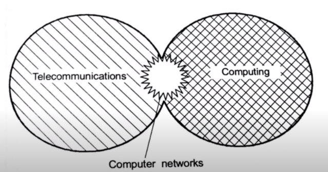

# Computer Networks

### Network

- A group of interconnected things forms a network.
- eg→ water supply system in ancient rome.

### Computer Network

- Is a set of computers connected together for a purpose of sharing resources and those resources can be internet a printer or a file server.

### Computing

- The process of utilizing computer technology to complete tasks and the task can be swapping a debit  card,  making a call or sending an email, computing involves the use of computer system like a pc, atm maching , smart phone or any other eletronic device.

### Computer Networks

- since the computer networks involves the use of computers for computing and telecommunication techonology like telephone lines , wireless radio links for transmitting the process data over long distances so the computer networks can be said to be evolved at the interface of telecommunication and computing.

- The first computer network that apeared was ARPANET that joined geographically distributed computer to each other that wide area network is now a days  know as INTERNET.
- 💡Note
    - The First Personal Computer Appeared in the early 1980’s.
    - Commercial use of INTERNET started in early 1980’s.
    - World Wide Web was invented in 1991.

## Ip Address

- Computers and Internet communicate with each other with underground or under water cables or wirelessly.
- If we want to download a file from internet than our computer should have an address so that other computers in internet can locate my computer, in Internet terms that address is called as **IP ADDRESS**.
- stands for Internet Protocol Address, Internet Protocol is a set of rules that mades internet work.
- IP Address is of two type IPV4 and IPV6.

### **IPV4**

- address consists of 4 numbers and each number is seperated by a dot (.)
- Each number can range from (0 - 255) in decimal numbers i.e base 10, but computers cannot understand decimal numbers so they are converted into binary form which are computer understandable.
- so in binary this range is wriiten as (00000000 - 1111111) in binary i.e base 2.
- So each number is represent by a group of 8 binary digits so the whole IPV4 address is represented by a 32 bits sequence consisting of 0 or 1.
- IPV4 is a 32-BIT Address.
- So with these number of bits we can assign address to 2 ^ 32 devices i.e 4,294,967,296 ( so , approx 4 billion devices can be addressed and  connected to internet.)
- With 32-BIT Address we can address only about 4 billion devices but today devices such as computers and smartphones are more that 4 billion so slowly we are moving towards IPV6 Adress which is a 128-BIT Address.

### **IPV6**

- address is represented as a group of 8 hexadicimal numbers seperated with colons (:)
- A single group of hexadicimal numbers is represented using 16 bits, making it a complete ( 16 * 8 ) bit sequence.
- It is written as 128 bit Address consisting of 0 and 1.
- IPV6 can address 2 ^ 128 devices and connected them with internet.

## IP Addresses are classified as

### Dynamic IP Address

- when we connect are devices to internet  isp **(internet service provider)** provide us an IP Address from a range of available ip addresses from which we can connected to the internet and send and recieve data from any where over the internet. Next time we connect to the internet the isp provides us an different ip address but from a same available range.
- Ip addresses keeps on changing every time we connect are devices to the internet so such ip addresses are called dynamic IP Adresses.

### Static IP Address

- These addresses never change they server as permanent internet address.
- eg. DNS server uses static ip address, DNS server are computers that helps to open a website in our computer.
- These addresses provide information that devices are located in which continent → country → city and which internet service provider provides internet connection to that device. once we know who is the isp we can trace the location of that device connected to internet.
- These address are considered somehow less secure than dynamic ip addresses as they are easier to track.

## Network Protocols

- Set of rules and convention that network devices such as computer or smartphone should follow.
- These  protocols help to make effective connections among networking devices.
- Modern computer networks send data from one computer to another in form of data packets in which all files are divided into small pieces, some security measures are added to each packet and these packets are received and reassembled at destination to generate the orignal file.
- The security measures that are added to each piece are decided by network protocols and the receiving computer should be able to understand the received packet and the whole file if it follows the networking protocols.
- Network protocols includes,
    - Wireless  Network Protocols
    - Internet Protocols
    - Network Routing Protocols
    
    **Internet Protocols** are needed for proper functioning of Internet and includes, TCP, UDP,  HTTP, FTP (these four protocols interact with the applications like web browsers) ARP, ICMP (these two protocols interact with network adapters for ic’s .
    
    **Wireless Network Protocols** are needed for proper functioning of WiFi, Bluetooth and LTE.
    
    **Network Routing Protocols** are needed for deciding best downloading path for devices to download a file from the internet. It includes EIGRP, OSPF, BGP.
    

### NIC (Network Interface Card)

- It is a seperate computer hardware component present in our computer used to connect and share data among different computers.
- They are also called as, Network Interface Controller, Network Adapter or Lan Adapter.
- NIC card can be wired or wireless
- NIC that is used to share data using lan cables are called wired NIC.
- Data sharing between two devices by connecting them to a WIFI network is done by wireless NIC.