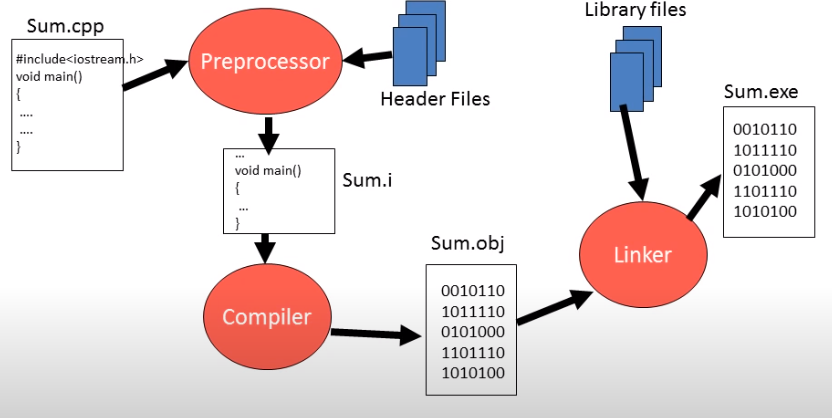

# OOPS IN C++

- C++ is extended verstion of C, developed by **Bjarne Stroustrup in 1979** at **AT & T’s Bell Labs.**
- The first version of C++ is also known as **C with classes**.
- In 1983 the name C++ is termed.
- C++’s OOP aspect was inspired by a computer simulation language called **Simula67.**
- **JAVA** is written in C++. (The very first Java compiler was developed by Sun Microsystems and was written in C using some libraries from C++. Today, **the Java compiler is written in Java, while the JRE is written in C.)**

## Features of C++

- C++ is a **middle level language.** (used for low level programming or machine dependent coding for system softwares like device drivers and high level programming for application software and they are hardware independent).
- C++ supports principles of object oriented paradigm.
- C++ joins three separate programming traditions
    - the **procedural language** tradition, represent by C.
    - the **object-oriented** language tradition, represented by the class enhancement c++ adds to C.
    - **generic programming** , suport by c++ templates.

## Comparison between C and C++

- C++ is a super set of C language.
- C++ programs can use existing C software libraries.
- C follows top down appraoch of programming.
- C++ follows bottom up approach of programming.
- C adopts procedure Oriented programming.
- C++ adopts procedure as well as object Oriented programming.

## Object Oriented Programming

- OOPs is a programming approach which revolves around the concept of “Object”.
- Any entity in the system that can be defined as a set of properties and set of operations performed using entity’s property set, is known as Object.
- Encapsulation, DataHiding, Abstraction, Polymorphism, Inheritance.

## Concept of Classes and Objects

- Class is a blueprint of an Object.
- Class is a description of Object’s property set and set of operations.
- Creating class is as good as defining a new data type. (user defined datatype)
- Class is a means to achieve Encapsulation.
- Object is a run time entity.
- Object is an instance of a class.

## Software Development in C++



## Reference Variable in C++

- Reference means address.
- Reference variable is an internal pointer.
- Declaration of Reference variable is preceded with ‘&’ symbol (but do not read it as ‘address of’)
- Reference variables must be initialized during declaration.
- It can be initialized with already declared variables only.
- Reference variable cannot be updated.
- eg int &y = x;
- if we take reference of x in y that means modifying y is same as modifying x. (y is just another name for x, but y  is at sepeate variable which has reference of x).+

### Call by value

- When formal arguments are ordinary variables, it is function call by value.

```cpp
#include<iostream>
using namespace std;

int sum(int,int);

int main(){
    
    int a = 5, b = 6;
    int s = sum(a, b);
    
    cout<<"sum is " << s <<endl;
}

int sum(int a, int b){
    return (a + b);
}
```

### Call by Address

- When formal arguments are pointer variables, it is function call by addresss.

```cpp
#include<iostream>
using namespace std;

int sum(int* ,int*);

int main(){
    
    int a = 5, b = 6;
    int s = sum(&a, &b);
    
    cout<<"sum is " << s <<endl;
}

int sum(int *a, int *b){
    return (*a + *b);
}
```

### Call by reference

- When formal arguments are reference variables, it is function call by reference.

```cpp
#include<iostream>
using namespace std;

int sum(int& ,int&);

int main(){
    
    int a = 5, b = 6;
    int s = sum(a, b);
    
    cout<<"sum is " << s <<endl;
}

int sum(int& a, int& b){
    return (a + b);
}
```

## Inline Function

- Function is time consuming, every time a function is called, it takes a lot of extra time in executing a series of instructions for tasks such as jumping functions, saving registers, pushing arguments into the stack and returning to the calling function.
- So when function is small it is worthless to spend so much extra time in such tasks in cost of saving comparatively small space.
- To eliminate the cost of calls to small functions, C++ proposes a new feature called inline functions.
- An inline function is a function that is expanded in line when it is invoked.
- Compiler replaces the function call with the corredponding function code.
- Inline is a request not a command.
- The benifit of speed of inline functions reduces as the function grows in size.
- so compiler may ignore the request in some situations like
    - function containing loops, switch, goto.
    - functions with recursion
    - containing static variable.

```cpp
#include<iostream>
using namespace std;

inline void fun(); // function declaration
 
int main()
{
    cout<<"Main Function"<<endl;
    fun();  // function call
}

void fun()  // function definition
{
    cout<<"inside fun"<<endl;   
}
```

## Default Arguments

- Whenever we want to use a same function for 2 uses like for adding 2 numbers and adding 3 numbers so either we have to make seperate definitions for both the addtions or we can use default arguments.
- default arguments we can define in function argument as **int  = 0** which means if no value is passed for that argument it will be treated as 0 and no error will be occured.
- so we will able to call the same function both with 2 and 3 arguments.
- if we want to set an argument as default arugument then after that also we have to set all argument as default arguments.

```cpp
#include<iostream>
using namespace std;
 
int add(int, int, int = 0); // default argument

int main()
{
    int a, b;
    cout<<"Enter 2 numbers "<<endl;
    cin >> a >> b;
    
    cout<<"Sum of 2 numbers is "<<add(a, b)<<endl;
    
    int c;
    
    cout<<"Enter 3 numbers "<<endl;
    cin >> a >> b >> c;
    
    cout<<"Sum of 3 numbers is "<<add(a, b, c)<<endl;
}

int add(int a, int b, int c)
{
    return (a + b + c);
}
```

## Function Overloading

- This is a way to achieve Polymorphism in C++.(one name many forms).
- Function Overloading is a Compile time polyformphism.
- If one function is overloaded with different jobs this is known as function overloading.
- This is early binding compiler bind the function with it’s appropriate definition.
- Function use 3 rules to find the appropriate definiton of the caller function.
    - First,  C++ tries to find an exact match. This is the case where the actual arguments exactly matches the parameter type of one of the overladed functions.
    - If no exact match is found, C++ tries to find a match through promotion
        - Char, unsigned char, and short is promoted to an int.
        - Float is pormoted to double.
    - If no promotion is found, C++ tries to find a match through standard conversion.
    
    ```cpp
    #include<iostream>
    using namespace std;
    
    int area(int ,int); // function declaration
    float area(int);
    
    int main()
    {
        int r;
        cout<<"Enter radius of a circle "<<endl;
        cin >> r;
        
        float A = area(r);  // function call
        
        cout<<"Area of Circle "<<A<<endl;
        
        int l, b, a;
        cout<<"Enter length and breadth of rectangle "<<endl;
        cin >> l >> b;
        
        a = area(l, b);
        
        cout<<"Area of Rectangle : "<<a<<endl;
        
        return 0;
    }
    
    int area(int l,  int b) // function definition
    {
        return (l * b);
    }
    
    float area(int r)
    {
        return (3.14 * r * r);
    }
    ```
    

## Structure in C++

- Structures is collection of dissimilar elements.
- Structure is a way to group variables.
- Structure is used to create data type.

### 1. creating Structure and Structure variables

```cpp
#include<iostream>
#include<cstring>
using namespace std;

struct Book{
  int bookId;
  char title[30];
  float price;
};

int main()
{
    // struct Book b1; // writing struct keyword is optional in c++
    Book b1 = {1, "C++", 100};
    
    Book b2, b3;
    
    b2.bookId = 2;
    
    // b2.title = "C is a middle level language" // this is wrong because
    /*
    b2.title represent array name and array name represents the address
    of it's first block and we cannot assign something to a constant value.
    lvalue error.
    */
    
    // assigning string to character array
    strcpy(b2.title, "C is a middle level language");
    
    b2.price = 200;
    
    b3 = b2; // we can assign ,as both are of same type 
    
    cout<<b1.bookId<<' '<<b1.title<<' '<<b1.price<<endl;
    cout<<b2.bookId<<' '<<b2.title<<' '<<b2.price<<endl;
    cout<<b3.bookId<<' '<<b3.title<<' '<<b3.price<<endl;
    
    return 0;
}
```

### 2. User input in Structures

```cpp
#include<iostream>
#include<cstring>
using namespace std;

struct Book{
  int bookId;
  char title[30];
  float price;
};

Book input();
void display(Book);

int main()
{
    
    Book b1;
    
    b1 = input();
    display(b1);
    
    return 0;
}

Book input()
{
    Book b;
    
    cout<<"Enter Book id "<<endl;
    cin >> b.bookId;
    
    cout<<"Enter Book title "<<endl;
    cin >> b.title;
    
    cout<<"Enter Book Price "<<endl;
    cin >> b.price;
    
    return b;
}

void display(Book b)
{
    cout<<"Book id is "<<b.bookId<<endl;
    cout<<"Book title is "<<b.title<<endl;
    cout<<"Book price is "<<b.price<<endl;
}
```

### 3. Encapsulation in Structure

- Unlike C we can have member functions inside structure also in C++.
- In C structure we can only group variables but in C++ structures we can group variables as well as functions.
- So encapsulation is achieved as data members and member functions are wrapped in a single entity.

```cpp
#include<iostream>
#include<cstring>
using namespace std;

struct Book{
  int bookId;
  char title[30];
  float price;
  
  void input()
  {
      cout<<"Enter Book id "<<endl;
      cin >> bookId;
    
      cout<<"Enter Book title "<<endl;
      cin >> title;
    
      cout<<"Enter Book Price "<<endl;
      cin >> price;
  }
  
  void display()
  {
      cout<<"Book id is "<<bookId<<endl;
      cout<<"Book title is "<<title<<endl;
      cout<<"Book price is "<<price<<endl;
  }
  
};

int main()
{
    
    Book b1;
    
    b1.input();
    b1.display();
    
    return 0;
}
```

### 4. Abstraction in Structure

- we can use access specifiers such as private,  protected and public in structures.
- private means the private variables cannot be access outside the structure body therefore they can only access by the  member functions inside the structure and that function need to be public as public member functions can be access from outside the structure.
- by default all data members and member functions are public inside a structure.

```cpp
#include<iostream>
#include<cstring>
using namespace std;

struct Book{
    
  private:
      int bookId;
      char title[30];
      float price;
  
  public:
      void input()
      {
          cout<<"Enter Book id "<<endl;
          cin >> bookId;
        
          cout<<"Enter Book title "<<endl;
          cin >> title;
        
          cout<<"Enter Book Price "<<endl;
          cin >> price;
      }
      
      void display()
      {
          cout<<"Book id is "<<bookId<<endl;
          cout<<"Book title is "<<title<<endl;
          cout<<"Book price is "<<price<<endl;
      }
  
};

int main()
{
    
    Book b1;
    
    // b1.bookId = 100; error as bookId is private and hence cannot be accessed from outside
    
    b1.input();
    b1.display();
    
    return 0;
}
```

## Classes and Objects in C++

## Class and Structures

- The only difference between structure and class is that,
    - the members of structures are by default public and the members of class by default private.
    - concepts of structures and classes are same.
    - Class variable is called as object. (object comsumes memory)
    - Below is struct and class definition both do the same job.
    
    ```cpp
    // Structure
    struct Book{
        
      private:
          int bookId;
          char title[30];
          float price;
      
      public:
          void input()
          {
              cout<<"Enter Book id "<<endl;
              cin >> bookId;
            
              cout<<"Enter Book title "<<endl;
              cin >> title;
            
              cout<<"Enter Book Price "<<endl;
              cin >> price;
          }
          
          void display()
          {
              cout<<"Book id is "<<bookId<<endl;
              cout<<"Book title is "<<title<<endl;
              cout<<"Book price is "<<price<<endl;
          }
      
    };
    ```
    
    ```cpp
    // Class
    class Book{
        
      private:
          int bookId;
          char title[30];
          float price;
      
      public:
          void input()
          {
              cout<<"Enter Book id "<<endl;
              cin >> bookId;
            
              cout<<"Enter Book title "<<endl;
              cin >> title;
            
              cout<<"Enter Book Price "<<endl;
              cin >> price;
          }
          
          void display()
          {
              cout<<"Book id is "<<bookId<<endl;
              cout<<"Book title is "<<title<<endl;
              cout<<"Book price is "<<price<<endl;
          }
      
    };
    ```
    
- We can also define member function outside the class body, but if we define it outside it do not termed as member function so for making member function of class outside class we have to follow 2 conditions.
    - we have to declare it inside class.
    - and in outside declaration membership label should be written between function name and function return type.
        - member ship label will be **className::** (class name followed by scope resolution operator) and now it termed as member function.
- When we define function inside of class that function is by default inline but when we declare member function outside following above two conditions for making it inline we have to write inline keyword.

```cpp
// declaring member function outside the class / structure

#include<iostream>
using namespace std;

class Complex
{
    private:
        int a, b;
    public:
        void set_data(int, int);  // we have to declare the function inside
        
        void show_data()
        {
            cout<<"a = "<<a << ' '<<"b = "<<b<<endl;
        }
};

// membership label should be written between function return type and function name

void Complex:: set_data(int x, int y)
{
    a = x;
    b = y;
}

int main()
{
    Complex c1;
    
    c1.set_data(3, 4);
    
    c1.show_data();
    
    return 0;
}
```

## Function call by passing object and returning object

### Adding 2 complex numbers

```cpp
#include<iostream>
using namespace std;

class Complex
{
    private:
        int a, b;
    public:
        void set_data(int x, int y)
        {
            a = x;
            b = y;
        }
        
        void show_data()
        {
            cout<<"a = "<<a << ' '<<"b = "<<b<<endl;
        }
        
        Complex add(Complex c)
        {
            Complex temp;
            
            temp.a = a + c.a;
            temp.b = b + c.b;
            
            return temp;
        }
};

int main()
{
    Complex c1, c2, c3;
    
    c1.set_data(3, 4);
    
    c2.set_data(4, 3);
    
    c3 = c1.add(c2);
    
    c3.show_data();
    
    return 0;
}
```

### Classes and object

- Class is a description of an object.
- Object is an instance of class.
- Instance member variable
    - Attributes, data members, fields, properties.
- Instance member functions
    - Methods, procedures, actions, operations,  services.

## Static Members in C++

### Static Local Variable

- They are preceded by a static keyword, eg **static int x** ;
- They are by default initialized to zero.
- All the static variables are given the memory at the very start of the program.
- Their lifetime is throughout the program.
- only one copy of a static variable exist throughout the program andis shared among all the objects.

```cpp
#include<iostream>
using namespace std;

void fun()
{
    static int x;  // by default 0
    
    int y;
    
    ++x;

    y = -1;
    
    cout<<"value of x is "<<x <<' '<<"value of y is "<<y<<endl;
}

int main()
{
    fun();
    fun();
    fun();
}

// only one copy exist for x throughout the program.
// new copy of y is creating eveytime we call the fun();
```

### output


### Static Member Variable

- declared inside the class body.
- also known as class member variable.
- They must be defined outside the class using membership label.
- Static member variable does not belong to any object, but to the whole class.
- There will be only one copy of static member variable for the whole class.
- Any object can use the same copy of class variable.
- They can also be used with class name.
- Static member variable declared inside the class doesn’t get memory by creating the object of the class we have to give them memory by defining them outside the class using membership label.

```cpp
#include<iostream>
using namespace std;

class Account{
    private:
        int balance;    // instance member variable
    public:
        static float roi;   // static member variable or class variable

        void setBalance(int b)
        {
            balance = b;
        }
        void getBalance()
        {
            cout<<"balance after interest " <<balance*roi<<endl;
        }
};

float Account:: roi = 4.5f;  // if we don't assign any value than by default 0

int main()
{
    Account a1, a2; // static member variable inside class do not get the memory unless we declare and define them
    
    // a1 contain only 1 variable that is balance
    // roi variable is not the part of the object
    // that means either we create object of class Account or not roi variable exist
    // but we need to give it memory by defining it outside class using membership lable.
    
    // If we don't define roi, then roi variable will not be created,
    // when we declare this variable inside and define outside then only it get memory
    // that's why it is not called as instance variable but class variable
    
    a1.setBalance(100);
    a1.getBalance();
    
    cout<<a1.roi<<endl; // can be accessed like this if object is created
    
    // If object is not created it can be always accesed using class name
    
    cout<<Account::roi<<endl;  // accessing static member using class name(membership label) // it has to be declared publid
    
    return 0;
}
```

**In the above eg,** 

- a1(object) contain only 1 variable that is balance roi variable is not the part of the object that means either we create object of class Account or not roi variable exist but we need to give it memory by defining it outside class using membership lable.
- If we don't define roi, then roi variable will not be created, when we declare this variable inside and define outside then only it get memory that's why it is not called as instance variable but class variable.

### Static Member Function

- They are qualified with the keyword static.
- They are also called class member functions.
- They can be invoked with or without object.
- They can only access static memebers of the class.
- When we need to intiailise static variable and static variable is private then we make a static function because that is accessible without creating an object through class name and can access static variables.
- so when static variable is private and we need to initialise it without creating object than we cannot do it using instance method therefore static method is required.

```cpp
#include<iostream>
using namespace std;

class Account{
    private:
        int bal;    // instance member Variable
        static float roi; // static Member Variable / class Variable
    public:
        void setBalance(int b)
        {
            bal = b;
        }
        
        static void setRoi(float r) // static member function
        {
            roi = r;
            cout<<"roi = "<<roi<<endl;
        }
};

float Account:: roi; // define outside for creation

int main()
{
    // initialised without creating object using static member function as they can be called using class name
    // and when static Variable is private there is no other way to initialised without creating object
    Account::setRoi(4.5f); 
    
    return 0;
}
```

## Constructors in C+

- Constructor is a member function of a class.
- The name of the constructor is same as the name of the class.
- It has no return type.
- It must be an instance member function, that is , it can never be static.
- Constructor is implicitly invoked when an object is created.
- Contructor is used to solve the problem of initialization.

```cpp
#include<iostream>
using namespace std;

class Complex{
    private:
        int a, b;
    public:
        Complex(){
            cout<<"Contructor";
        }
};

int main()
{
    Complex c1;
    
    return 0;
}
```

- We write that coding part in constructor which we want to run as soon as we create the object, intialization is one thing because if not done the variables will contain garbage values.

## Types of Constructor

### 1. Default Constructor

- Compiler creates default Constructor by default which is called as implicit default constructor that means if object is created constructor will definitely be called.
- Default constructor is the constructor which doesn’t take any argument. It has no parameters. It is also called a zero-argument constructor.
- If we create any constructor by ourself than compiler will not create default constructor and therefore we have to define all constructors with respect to appropriate parameters.

### 2. Parameterized Constructor

- An Constructor with parameters is known as parameterized constructor.
- ***Note:** when the parameterized constructor is defined and no default constructor is defined explicitly, the compiler will not implicitly call the default constructor and hence creating a simple object as*

```
Complex c;
Will flash an error
```

- **Uses of Parameterized constructor:**
    1. It is used to initialize the various data elements of different objects with different values when they are created.
    2. It is used to overload constructors.
- **Can we have more than one constructor in a class?** Yes, It is called **Constructor Overloading**.

### 3. Constructor Overloading (overload constructors)

- It is same as function overloading, constructor which is a function with same name but different arguments.
- If we make object with arguments than the constructor with that number of parameters should be present in the class.
- Compiler creates default constructor and copy constructor by default but if we make parameterized constructor than compiler do not create default constructor. Therefore if we create any object with given number of arguments or 0 argumens than we should also define appropriate constructors with appropriate parameters.

```cpp
// Constructor Overloading
#include<iostream>
using namespace std;

class Complex{
    private:
        int a, b;
    public:
        Complex(){  // default constructor
            cout<<"Default Constructor"<<endl;
            cout<<"This is created by Default if we do not define by ourself"<<endl;
        }
        Complex(int x)  // parameterized constructor
        {
            cout<<"parameterized Constructor with 1 parameter"<<endl;
            a = x;
        }
        Complex(int x, int y)  // parameterized constructor
        {
            cout<<"parameterized Constructor with 2 parameter"<<endl;
            a = x;
            b = y;
        }
};

int main()
{
    Complex c1, c2(3, 4);
	
	  Complex c3 = Complex(5, 4);  //  constructor is also called like this
	
	  // if we have to pass only 1 argument than there are 2 ways to call Constructor
    
    Complex c4 = 5;
    Complex c5 = Complex(8);
    
    cout<<"Compiler will not create Default Constructor if we define any Constructor by ourself"<<endl;;
    
    return 0;
}
```

- Default Constructor is created by Default if we do not define by ourself.
- Compiler will not create Default Constructor if we define any Constructor by ourself.

### 4. Copy Constructor

- A copy constructor is a member function that initializes an object using another object of the same class.
- Copy constructor takes a reference to an object of the same class as an argument.
- Copy Constructor is created and called by the compiler itself.
- If we create the copy constructor by ourself then compiler will not create the copy constructor.

```
Sample(Sample &t)
          {
                     id=t.id;
          }
```

**Implicit copy constructor copy created by compiler**

```cpp
#include<iostream>
using namespace std;

class Complex{
    private:
        int a, b;
    public:
       Complex(){
           cout<<"default Constructor"<<endl;
       }
       Complex(int x, int y)
       {
           cout<<"parameterized Constructor"<<endl;
       }
};

int main()
{
    Complex c1, c2(3, 4);
    
    Complex c3(c2);  // now this seems to be an error because
    // we passed an argument of complex type and no constructor is define which 
    // takes parameter of complex type but there will not be any error because
    // copy constructor will handle that which is by default created and called by compiler.
	
    return 0;
}
```

- In above code, we passed an argument of complex type and no constructor is define which takes parameter of complex type but there will not be any error because copy constructor will handle that which is by default created and called by compiler.
    
    **explicit copy constructor created by us**
    
    ```cpp
    #include<iostream>
    using namespace std;
    
    class Complex{
        private:
            int a, b;
        public:
           Complex(){
               cout<<"default Constructor"<<endl;
           }
           Complex(int x, int y)
           {
               cout<<"parameterized Constructor"<<endl;
           }
           
           // we pass reference of an object to the copy Constructor
           Complex(Complex& c)
           {
               a = c.a;
               b = c.b;
           }
    };
    
    int main()
    {
        Complex c1, c2(3, 4);
        
        Complex c3(c2);
    	
        return 0;
    }
    ```
    
- We pass reference of the object to the copy constructor because if we do not pass the reference than the argument which we pass **c3(c2)**   c2 has to be assigned to the parameter complex c which means c has to initialized with c2 first that means an constructor will be called that will initialize **c(c2)** c with c2 but then an another parameter object is created to which we have to assign c2 and this way this will never over and end on recursion.
- **c3(c2) → c(c2) → c(c2) → ……… infinite ( error).**
- In simpler manner when complex c is created than c1 will again pass to it and call the same constructor.
- So, in this way we cannot create copy constructor.
- In above case we are creating object c that’s why constructor is being called, if we do not create the object then constructor will not called.
- Therefore, if we made it reference that constructor will not called as object is not created.
- now c contains reference of c2 and this is our copy constructor.

- **Compiler by default create default constructor and copy constructor by itself.**
- **if we define any constructor by ourself compiler will not create default constructor but copy constructor will be created.**
- **if we define copy constructor by ourself then compiler will not create any constructor.**

## Destructors in C++

- Destructor is an instance member function of a class.
- The name of the destructor is same as the name of a class but preceded by tilde(~) symbol.
- Destructor can never be static.
- Destructor has no return type.
- Destructor takes no argument(No overloading is possible)
- It is invoked implicitly when object is going to destroy.
- It should be defined to release resources allocated to an object.


- So for eg, the pointer variable of an object is pointing to resource so if the object is destroyed then its pointer is also destroyed and in above case the pointer is pointing to that resource and since now the pointer is destroyed so we lost access to the resource therfore inside destructor before the object is going to destroy we can release the resources allocated to object.

```cpp
// destructor
#include<iostream>
using namespace std;

class Complex{
    private:
        int a, b;
    public:
     
        ~Complex(){
            cout<<"Destructor"<<endl;
        }
       
};

int main()
{
    Complex c3;
	
    return 0;
}
```