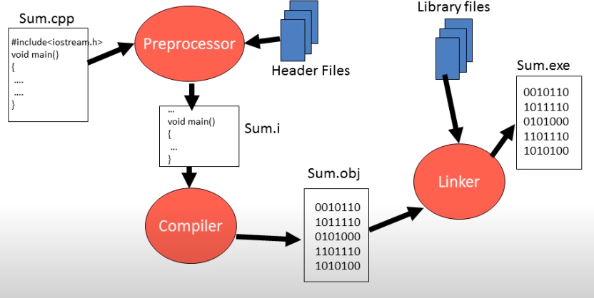
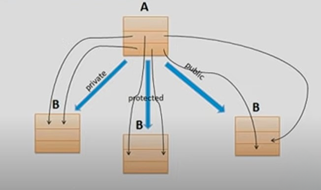

# OOPS IN C++

- C++ is extended verstion of C, developed by **Bjarne Stroustrup in 1979** at **AT & T’s Bell Labs.**
- The first version of C++ is also known as **C with classes**.
- In 1983 the name C++ is termed.
- C++’s OOP aspect was inspired by a computer simulation language called **Simula67.**
- **JAVA** is written in C++. (The very first Java compiler was developed by Sun Microsystems and was written in C using some libraries from C++. Today, **the Java compiler is written in Java, while the JRE is written in C.)**

## Features of C++

- C++ is a **middle level language.** (used for low level programming or machine dependent coding for system softwares like device drivers and high level programming for application software and they are hardware independent).
- C++ supports principles of object oriented paradigm.
- C++ joins three separate programming traditions
    - the **procedural language** tradition, represent by C.
    - the **object-oriented** language tradition, represented by the class enhancement c++ adds to C.
    - **generic programming** , suport by c++ templates.

## Comparison between C and C++

- C++ is a super set of C language.
- C++ programs can use existing C software libraries.
- C follows top down appraoch of programming.
- C++ follows bottom up approach of programming.
- C adopts procedure Oriented programming.
- C++ adopts procedure as well as object Oriented programming.

## Object Oriented Programming

- OOPs is a programming approach which revolves around the concept of “Object”.
- Any entity in the system that can be defined as a set of properties and set of operations performed using entity’s property set, is known as Object.
- Encapsulation, DataHiding, Abstraction, Polymorphism, Inheritance.

## Concept of Classes and Objects

- Class is a blueprint of an Object.
- Class is a description of Object’s property set and set of operations.
- Creating class is as good as defining a new data type. (user defined datatype)
- Class is a means to achieve Encapsulation.
- Object is a run time entity.
- Object is an instance of a class.

## Software Development in C++



## Reference Variable in C++

- Reference means address.
- Reference variable is an internal pointer.
- Declaration of Reference variable is preceded with ‘&’ symbol (but do not read it as ‘address of’)
- Reference variables must be initialized during declaration.
- It can be initialized with already declared variables only.
- Reference variable cannot be updated.
- eg int &y = x;
- if we take reference of x in y that means modifying y is same as modifying x. (y is just another name for x, but y  is at sepeate variable which has reference of x).+

### Call by value

- When formal arguments are ordinary variables, it is function call by value.

```cpp
#include<iostream>
using namespace std;

int sum(int,int);

int main(){
    
    int a = 5, b = 6;
    int s = sum(a, b);
    
    cout<<"sum is " << s <<endl;
}

int sum(int a, int b){
    return (a + b);
}
```

### Call by Address

- When formal arguments are pointer variables, it is function call by addresss.

```cpp
#include<iostream>
using namespace std;

int sum(int* ,int*);

int main(){
    
    int a = 5, b = 6;
    int s = sum(&a, &b);
    
    cout<<"sum is " << s <<endl;
}

int sum(int *a, int *b){
    return (*a + *b);
}
```

### Call by reference

- When formal arguments are reference variables, it is function call by reference.

```cpp
#include<iostream>
using namespace std;

int sum(int& ,int&);

int main(){
    
    int a = 5, b = 6;
    int s = sum(a, b);
    
    cout<<"sum is " << s <<endl;
}

int sum(int& a, int& b){
    return (a + b);
}
```

## Inline Function

- Function is time consuming, every time a function is called, it takes a lot of extra time in executing a series of instructions for tasks such as jumping functions, saving registers, pushing arguments into the stack and returning to the calling function.
- So when function is small it is worthless to spend so much extra time in such tasks in cost of saving comparatively small space.
- To eliminate the cost of calls to small functions, C++ proposes a new feature called inline functions.
- An inline function is a function that is expanded in line when it is invoked.
- Compiler replaces the function call with the corredponding function code.
- Inline is a request not a command.
- The benifit of speed of inline functions reduces as the function grows in size.
- so compiler may ignore the request in some situations like
    - function containing loops, switch, goto.
    - functions with recursion
    - containing static variable.

```cpp
#include<iostream>
using namespace std;

inline void fun(); // function declaration
 
int main()
{
    cout<<"Main Function"<<endl;
    fun();  // function call
}

void fun()  // function definition
{
    cout<<"inside fun"<<endl;   
}
```

## Default Arguments

- Whenever we want to use a same function for 2 uses like for adding 2 numbers and adding 3 numbers so either we have to make seperate definitions for both the addtions or we can use default arguments.
- default arguments we can define in function argument as **int  = 0** which means if no value is passed for that argument it will be treated as 0 and no error will be occured.
- so we will able to call the same function both with 2 and 3 arguments.
- if we want to set an argument as default arugument then after that also we have to set all argument as default arguments.

```cpp
#include<iostream>
using namespace std;
 
int add(int, int, int = 0); // default argument

int main()
{
    int a, b;
    cout<<"Enter 2 numbers "<<endl;
    cin >> a >> b;
    
    cout<<"Sum of 2 numbers is "<<add(a, b)<<endl;
    
    int c;
    
    cout<<"Enter 3 numbers "<<endl;
    cin >> a >> b >> c;
    
    cout<<"Sum of 3 numbers is "<<add(a, b, c)<<endl;
}

int add(int a, int b, int c)
{
    return (a + b + c);
}
```

## Function Overloading

- This is a way to achieve Polymorphism in C++.(one name many forms).
- Function Overloading is a Compile time polyformphism.
- If one function is overloaded with different jobs this is known as function overloading.
- This is early binding compiler bind the function with it’s appropriate definition.
- Function use 3 rules to find the appropriate definiton of the caller function.
    - First,  C++ tries to find an exact match. This is the case where the actual arguments exactly matches the parameter type of one of the overladed functions.
    - If no exact match is found, C++ tries to find a match through promotion
        - Char, unsigned char, and short is promoted to an int.
        - Float is pormoted to double.
    - If no promotion is found, C++ tries to find a match through standard conversion.
    
    ```cpp
    #include<iostream>
    using namespace std;
    
    int area(int ,int); // function declaration
    float area(int);
    
    int main()
    {
        int r;
        cout<<"Enter radius of a circle "<<endl;
        cin >> r;
        
        float A = area(r);  // function call
        
        cout<<"Area of Circle "<<A<<endl;
        
        int l, b, a;
        cout<<"Enter length and breadth of rectangle "<<endl;
        cin >> l >> b;
        
        a = area(l, b);
        
        cout<<"Area of Rectangle : "<<a<<endl;
        
        return 0;
    }
    
    int area(int l,  int b) // function definition
    {
        return (l * b);
    }
    
    float area(int r)
    {
        return (3.14 * r * r);
    }
    ```
    

## Structure in C++

- Structures is collection of dissimilar elements.
- Structure is a way to group variables.
- Structure is used to create data type.

### 1. creating Structure and Structure variables

```cpp
#include<iostream>
#include<cstring>
using namespace std;

struct Book{
  int bookId;
  char title[30];
  float price;
};

int main()
{
    // struct Book b1; // writing struct keyword is optional in c++
    Book b1 = {1, "C++", 100};
    
    Book b2, b3;
    
    b2.bookId = 2;
    
    // b2.title = "C is a middle level language" // this is wrong because
    /*
    b2.title represent array name and array name represents the address
    of it's first block and we cannot assign something to a constant value.
    lvalue error.
    */
    
    // assigning string to character array
    strcpy(b2.title, "C is a middle level language");
    
    b2.price = 200;
    
    b3 = b2; // we can assign ,as both are of same type 
    
    cout<<b1.bookId<<' '<<b1.title<<' '<<b1.price<<endl;
    cout<<b2.bookId<<' '<<b2.title<<' '<<b2.price<<endl;
    cout<<b3.bookId<<' '<<b3.title<<' '<<b3.price<<endl;
    
    return 0;
}
```

### 2. User input in Structures

```cpp
#include<iostream>
#include<cstring>
using namespace std;

struct Book{
  int bookId;
  char title[30];
  float price;
};

Book input();
void display(Book);

int main()
{
    
    Book b1;
    
    b1 = input();
    display(b1);
    
    return 0;
}

Book input()
{
    Book b;
    
    cout<<"Enter Book id "<<endl;
    cin >> b.bookId;
    
    cout<<"Enter Book title "<<endl;
    cin >> b.title;
    
    cout<<"Enter Book Price "<<endl;
    cin >> b.price;
    
    return b;
}

void display(Book b)
{
    cout<<"Book id is "<<b.bookId<<endl;
    cout<<"Book title is "<<b.title<<endl;
    cout<<"Book price is "<<b.price<<endl;
}
```

### 3. Encapsulation in Structure

- Unlike C we can have member functions inside structure also in C++.
- In C structure we can only group variables but in C++ structures we can group variables as well as functions.
- So encapsulation is achieved as data members and member functions are wrapped in a single entity.

```cpp
#include<iostream>
#include<cstring>
using namespace std;

struct Book{
  int bookId;
  char title[30];
  float price;
  
  void input()
  {
      cout<<"Enter Book id "<<endl;
      cin >> bookId;
    
      cout<<"Enter Book title "<<endl;
      cin >> title;
    
      cout<<"Enter Book Price "<<endl;
      cin >> price;
  }
  
  void display()
  {
      cout<<"Book id is "<<bookId<<endl;
      cout<<"Book title is "<<title<<endl;
      cout<<"Book price is "<<price<<endl;
  }
  
};

int main()
{
    
    Book b1;
    
    b1.input();
    b1.display();
    
    return 0;
}
```

### 4. Abstraction in Structure

- we can use access specifiers such as private,  protected and public in structures.
- private means the private variables cannot be access outside the structure body therefore they can only access by the  member functions inside the structure and that function need to be public as public member functions can be access from outside the structure.
- by default all data members and member functions are public inside a structure.

```cpp
#include<iostream>
#include<cstring>
using namespace std;

struct Book{
    
  private:
      int bookId;
      char title[30];
      float price;
  
  public:
      void input()
      {
          cout<<"Enter Book id "<<endl;
          cin >> bookId;
        
          cout<<"Enter Book title "<<endl;
          cin >> title;
        
          cout<<"Enter Book Price "<<endl;
          cin >> price;
      }
      
      void display()
      {
          cout<<"Book id is "<<bookId<<endl;
          cout<<"Book title is "<<title<<endl;
          cout<<"Book price is "<<price<<endl;
      }
  
};

int main()
{
    
    Book b1;
    
    // b1.bookId = 100; error as bookId is private and hence cannot be accessed from outside
    
    b1.input();
    b1.display();
    
    return 0;
}
```

## Classes and Objects in C++

## Class and Structures

- The only difference between structure and class is that,
    - the members of structures are by default public and the members of class by default private.
    - concepts of structures and classes are same.
    - Class variable is called as object. (object comsumes memory)
    - Below is struct and class definition both do the same job.
    
    ```cpp
    // Structure
    struct Book{
        
      private:
          int bookId;
          char title[30];
          float price;
      
      public:
          void input()
          {
              cout<<"Enter Book id "<<endl;
              cin >> bookId;
            
              cout<<"Enter Book title "<<endl;
              cin >> title;
            
              cout<<"Enter Book Price "<<endl;
              cin >> price;
          }
          
          void display()
          {
              cout<<"Book id is "<<bookId<<endl;
              cout<<"Book title is "<<title<<endl;
              cout<<"Book price is "<<price<<endl;
          }
      
    };
    ```
    
    ```cpp
    // Class
    class Book{
        
      private:
          int bookId;
          char title[30];
          float price;
      
      public:
          void input()
          {
              cout<<"Enter Book id "<<endl;
              cin >> bookId;
            
              cout<<"Enter Book title "<<endl;
              cin >> title;
            
              cout<<"Enter Book Price "<<endl;
              cin >> price;
          }
          
          void display()
          {
              cout<<"Book id is "<<bookId<<endl;
              cout<<"Book title is "<<title<<endl;
              cout<<"Book price is "<<price<<endl;
          }
      
    };
    ```
    
- We can also define member function outside the class body, but if we define it outside it do not termed as member function so for making member function of class outside class we have to follow 2 conditions.
    - we have to declare it inside class.
    - and in outside declaration membership label should be written between function name and function return type.
        - member ship label will be **className::** (class name followed by scope resolution operator) and now it termed as member function.
- When we define function inside of class that function is by default inline but when we declare member function outside following above two conditions for making it inline we have to write inline keyword.

```cpp
// declaring member function outside the class / structure

#include<iostream>
using namespace std;

class Complex
{
    private:
        int a, b;
    public:
        void set_data(int, int);  // we have to declare the function inside
        
        void show_data()
        {
            cout<<"a = "<<a << ' '<<"b = "<<b<<endl;
        }
};

// membership label should be written between function return type and function name

void Complex:: set_data(int x, int y)
{
    a = x;
    b = y;
}

int main()
{
    Complex c1;
    
    c1.set_data(3, 4);
    
    c1.show_data();
    
    return 0;
}
```

## Function call by passing object and returning object

### Adding 2 complex numbers

```cpp
#include<iostream>
using namespace std;

class Complex
{
    private:
        int a, b;
    public:
        void set_data(int x, int y)
        {
            a = x;
            b = y;
        }
        
        void show_data()
        {
            cout<<"a = "<<a << ' '<<"b = "<<b<<endl;
        }
        
        Complex add(Complex c)
        {
            Complex temp;
            
            temp.a = a + c.a;
            temp.b = b + c.b;
            
            return temp;
        }
};

int main()
{
    Complex c1, c2, c3;
    
    c1.set_data(3, 4);
    
    c2.set_data(4, 3);
    
    c3 = c1.add(c2);
    
    c3.show_data();
    
    return 0;
}
```

### Classes and object

- Class is a description of an object.
- Object is an instance of class.
- Instance member variable
    - Attributes, data members, fields, properties.
- Instance member functions
    - Methods, procedures, actions, operations,  services.

## Static Members in C++

### Static Local Variable

- They are preceded by a static keyword, eg **static int x** ;
- They are by default initialized to zero.
- All the static variables are given the memory at the very start of the program.
- Their lifetime is throughout the program.
- only one copy of a static variable exist throughout the program andis shared among all the objects.

```cpp
#include<iostream>
using namespace std;

void fun()
{
    static int x;  // by default 0
    
    int y;
    
    ++x;

    y = -1;
    
    cout<<"value of x is "<<x <<' '<<"value of y is "<<y<<endl;
}

int main()
{
    fun();
    fun();
    fun();
}

// only one copy exist for x throughout the program.
// new copy of y is creating eveytime we call the fun();
```

### output


### Static Member Variable

- declared inside the class body.
- also known as class member variable.
- They must be defined outside the class using membership label.
- Static member variable does not belong to any object, but to the whole class.
- There will be only one copy of static member variable for the whole class.
- Any object can use the same copy of class variable.
- They can also be used with class name.
- Static member variable declared inside the class doesn’t get memory by creating the object of the class we have to give them memory by defining them outside the class using membership label.

```cpp
#include<iostream>
using namespace std;

class Account{
    private:
        int balance;    // instance member variable
    public:
        static float roi;   // static member variable or class variable

        void setBalance(int b)
        {
            balance = b;
        }
        void getBalance()
        {
            cout<<"balance after interest " <<balance*roi<<endl;
        }
};

float Account:: roi = 4.5f;  // if we don't assign any value than by default 0

int main()
{
    Account a1, a2; // static member variable inside class do not get the memory unless we declare and define them
    
    // a1 contain only 1 variable that is balance
    // roi variable is not the part of the object
    // that means either we create object of class Account or not roi variable exist
    // but we need to give it memory by defining it outside class using membership lable.
    
    // If we don't define roi, then roi variable will not be created,
    // when we declare this variable inside and define outside then only it get memory
    // that's why it is not called as instance variable but class variable
    
    a1.setBalance(100);
    a1.getBalance();
    
    cout<<a1.roi<<endl; // can be accessed like this if object is created
    
    // If object is not created it can be always accesed using class name
    
    cout<<Account::roi<<endl;  // accessing static member using class name(membership label) // it has to be declared publid
    
    return 0;
}
```

**In the above eg,** 

- a1(object) contain only 1 variable that is balance roi variable is not the part of the object that means either we create object of class Account or not roi variable exist but we need to give it memory by defining it outside class using membership lable.
- If we don't define roi, then roi variable will not be created, when we declare this variable inside and define outside then only it get memory that's why it is not called as instance variable but class variable.

### Static Member Function

- They are qualified with the keyword static.
- They are also called class member functions.
- They can be invoked with or without object.
- They can only access static memebers of the class.
- When we need to intiailise static variable and static variable is private then we make a static function because that is accessible without creating an object through class name and can access static variables.
- so when static variable is private and we need to initialise it without creating object than we cannot do it using instance method therefore static method is required.

```cpp
#include<iostream>
using namespace std;

class Account{
    private:
        int bal;    // instance member Variable
        static float roi; // static Member Variable / class Variable
    public:
        void setBalance(int b)
        {
            bal = b;
        }
        
        static void setRoi(float r) // static member function
        {
            roi = r;
            cout<<"roi = "<<roi<<endl;
        }
};

float Account:: roi; // define outside for creation

int main()
{
    // initialised without creating object using static member function as they can be called using class name
    // and when static Variable is private there is no other way to initialised without creating object
    Account::setRoi(4.5f); 
    
    return 0;
}
```

## Constructors in C+

- Constructor is a member function of a class.
- The name of the constructor is same as the name of the class.
- It has no return type.
- It must be an instance member function, that is , it can never be static.
- Constructor is implicitly invoked when an object is created.
- Contructor is used to solve the problem of initialization.

```cpp
#include<iostream>
using namespace std;

class Complex{
    private:
        int a, b;
    public:
        Complex(){
            cout<<"Contructor";
        }
};

int main()
{
    Complex c1;
    
    return 0;
}
```

- We write that coding part in constructor which we want to run as soon as we create the object, intialization is one thing because if not done the variables will contain garbage values.

## Types of Constructor

### 1. Default Constructor

- Compiler creates default Constructor by default which is called as implicit default constructor that means if object is created constructor will definitely be called.
- Default constructor is the constructor which doesn’t take any argument. It has no parameters. It is also called a zero-argument constructor.
- If we create any constructor by ourself than compiler will not create default constructor and therefore we have to define all constructors with respect to appropriate parameters.

### 2. Parameterized Constructor

- An Constructor with parameters is known as parameterized constructor.
- ***Note:** when the parameterized constructor is defined and no default constructor is defined explicitly, the compiler will not implicitly call the default constructor and hence creating a simple object as*

```
Complex c;
Will flash an error
```

- **Uses of Parameterized constructor:**
    1. It is used to initialize the various data elements of different objects with different values when they are created.
    2. It is used to overload constructors.
- **Can we have more than one constructor in a class?** Yes, It is called **Constructor Overloading**.

### 3. Constructor Overloading (overload constructors)

- It is same as function overloading, constructor which is a function with same name but different arguments.
- If we make object with arguments than the constructor with that number of parameters should be present in the class.
- Compiler creates default constructor and copy constructor by default but if we make parameterized constructor than compiler do not create default constructor. Therefore if we create any object with given number of arguments or 0 argumens than we should also define appropriate constructors with appropriate parameters.

```cpp
// Constructor Overloading
#include<iostream>
using namespace std;

class Complex{
    private:
        int a, b;
    public:
        Complex(){  // default constructor
            cout<<"Default Constructor"<<endl;
            cout<<"This is created by Default if we do not define by ourself"<<endl;
        }
        Complex(int x)  // parameterized constructor
        {
            cout<<"parameterized Constructor with 1 parameter"<<endl;
            a = x;
        }
        Complex(int x, int y)  // parameterized constructor
        {
            cout<<"parameterized Constructor with 2 parameter"<<endl;
            a = x;
            b = y;
        }
};

int main()
{
    Complex c1, c2(3, 4);
	
	  Complex c3 = Complex(5, 4);  //  constructor is also called like this
	
	  // if we have to pass only 1 argument than there are 2 ways to call Constructor
    
    Complex c4 = 5;
    Complex c5 = Complex(8);
    
    cout<<"Compiler will not create Default Constructor if we define any Constructor by ourself"<<endl;;
    
    return 0;
}
```

- Default Constructor is created by Default if we do not define by ourself.
- Compiler will not create Default Constructor if we define any Constructor by ourself.

### 4. Copy Constructor

- A copy constructor is a member function that initializes an object using another object of the same class.
- Copy constructor takes a reference to an object of the same class as an argument.
- Copy Constructor is created and called by the compiler itself.
- If we create the copy constructor by ourself then compiler will not create the copy constructor.

```
Sample(Sample &t)
          {
                     id=t.id;
          }
```

**Implicit copy constructor copy created by compiler**

```cpp
#include<iostream>
using namespace std;

class Complex{
    private:
        int a, b;
    public:
       Complex(){
           cout<<"default Constructor"<<endl;
       }
       Complex(int x, int y)
       {
           cout<<"parameterized Constructor"<<endl;
       }
};

int main()
{
    Complex c1, c2(3, 4);
    
    Complex c3(c2);  // now this seems to be an error because
    // we passed an argument of complex type and no constructor is define which 
    // takes parameter of complex type but there will not be any error because
    // copy constructor will handle that which is by default created and called by compiler.
	
    return 0;
}
```

- In above code, we passed an argument of complex type and no constructor is define which takes parameter of complex type but there will not be any error because copy constructor will handle that which is by default created and called by compiler.
    
    **explicit copy constructor created by us**
    
    ```cpp
    #include<iostream>
    using namespace std;
    
    class Complex{
        private:
            int a, b;
        public:
           Complex(){
               cout<<"default Constructor"<<endl;
           }
           Complex(int x, int y)
           {
               cout<<"parameterized Constructor"<<endl;
           }
           
           // we pass reference of an object to the copy Constructor
           Complex(Complex& c)
           {
               a = c.a;
               b = c.b;
           }
    };
    
    int main()
    {
        Complex c1, c2(3, 4);
        
        Complex c3(c2);
    	
        return 0;
    }
    ```
    
- We pass reference of the object to the copy constructor because if we do not pass the reference than the argument which we pass **c3(c2)**   c2 has to be assigned to the parameter complex c which means c has to initialized with c2 first that means an constructor will be called that will initialize **c(c2)** c with c2 but then an another parameter object is created to which we have to assign c2 and this way this will never over and end on recursion.
- **c3(c2) → c(c2) → c(c2) → ……… infinite ( error).**
- In simpler manner when complex c is created than c1 will again pass to it and call the same constructor.
- So, in this way we cannot create copy constructor.
- In above case we are creating object c that’s why constructor is being called, if we do not create the object then constructor will not called.
- Therefore, if we made it reference that constructor will not called as object is not created.
- now c contains reference of c2 and this is our copy constructor.

- **Compiler by default create default constructor and copy constructor by itself.**
- **if we define any constructor by ourself compiler will not create default constructor but copy constructor will be created.**
- **if we define copy constructor by ourself then compiler will not create any constructor.**

## Destructors in C++

- Destructor is an instance member function of a class.
- The name of the destructor is same as the name of a class but preceded by tilde(~) symbol.
- Destructor can never be static.
- Destructor has no return type.
- Destructor takes no argument(No overloading is possible)
- It is invoked implicitly when object is going to destroy.
- It should be defined to release resources allocated to an object.


- So for eg, the pointer variable of an object is pointing to resource so if the object is destroyed then its pointer is also destroyed and in above case the pointer is pointing to that resource and since now the pointer is destroyed so we lost access to the resource therfore inside destructor before the object is going to destroy we can release the resources allocated to object.

```cpp
// destructor
#include<iostream>
using namespace std;

class Complex{
    private:
        int a, b;
    public:
     
        ~Complex(){
            cout<<"Destructor"<<endl;
        }
       
};

int main()
{
    Complex c3;
	
    return 0;
}
```
## Operator Overloading

- When an operator is overloaded with multiple jobs, it is known as operator overloading.
- It is a way to implement compile time polymorphism.
- Any symbol can be used  as function name -
    - If it is a valid operator in C language and,
    - If it is preceded by operator keyword.
- We can not overload sizeof and ?: (conditional) operator.

## Overloading of Binary Operator

```cpp
// operator overloading of + operator

#include<bits/stdc++.h>
using namespace std;

class Complex{
  
  private:
    int a, b;
  public:
    void setData(int x, int y)
    {
        a = x;
        b = y;
    }
    
    void showData()
    {
        cout<<"a = "<<a << " "<<"b = "<<b<<endl;
    }
    
    // simple definition to add 2 object // without operator keyword function
    
    // Complex add(Complex c)
    // {
    //     Complex temp;
        
    //     temp.a = a + c.a;
    //     temp.b = b + c.b;
        
    //     return temp;
    // }
    
    Complex operator+(Complex c)
    {
        Complex temp;
        
        temp.a = a + c.a;
        temp.b = b + c.b;
        
        return temp;
    }
};

int main()
{
    Complex c1, c2, c3;
    
    c1.setData(3, 1);
    c2.setData(5, 6);
    
    // we call c1 and pass c2 as argument to add both object and
    // we get an returned object which will be assigned to c3.
    // c3 = c1.add(c2);  
    
    // we can use operator symbols as function name, but then we have to write operator keyword before that
    
    // c3 = c1.operator+(c2);  // 1 way
    
    // we can write this function without dot operator also, but then we don't have to write operator keyword also
    // and neither have to pass arguments in parenthisis
    
    c3 = c1 + c2; // 2 way
    
    
    // So for Complex class objects we overload the + operator and now we can use + between Complex objects.
    
    // So now + operator has one meaning to add primitive data and now
    // we made the second meaning which will only work when objects are of Complex types
    // and now + has more than one definitions.
    
    c3.showData();
    
    return 0;
}
```

The above code provinde 2 meaning to the + operator →

1. Adding primitive data.
2. Adding objects of complex type.

- We can name functions as operator symbols, but than we have to write operator keyword before them.
- we can call them as **c3 = c1.operator+(c2);  // function name is operator+**
- We can call this function without using dot operator also, but then we don’t have to write operator keyword also and neither we have to pass arguments in parenthisis.
- we can also call them as **c3 = c1 + c2;**
- So this way we overload the + operator with different jobs -
    - adding primitive data.
    - adding complex  type objects, we made the second meaning which will only work when objects are of complex types , so now + have more than one definitions.

## Overloading of  Unary Operator

```cpp
// unary operator
#include<bits/stdc++.h>
using namespace std;

class Complex{
  
  private:
    int a, b;
  public:
    void setData(int x, int y)
    {
        a = x;
        b = y;
    }
    
    void showData()
    {
        cout<<"a = "<<a << " "<<"b = "<<b<<endl;
    }
    
    Complex operator-()
    {
        Complex temp;
        
        temp.a = -a;
        temp.b = -b;
        
        return temp;
    }
};

int main()
{
    Complex c1, c2, c3;
    
    c1.setData(3, 1);
    
    // unary operator no argument
    
    // c2 = c1.operator-(); // one way
    
    c2 = -c1; // second way
    
    c2.showData();
    
    return 0;
}
```

- c1 calls -operator and no argument is passed , the value returned by -operator is assigned in c2.
- **(c2 = -c1;)**
- The above code provinde 2 meaning to the - operator →
    1. Subtracting primitive data.
    2. negating the data members of complex object.

## Unary and Binary Operators

- Binary operator **need 2 operands** to overload where one operand is caller object and other operand is the argument.
- in binary operator **left operand is caller object** (this rule is only applicable to binary operators).

- Unary operator **need 1 operand** to overload where caller object is the only operand.
- In unary operator operand **position depends on operator behaviour**, for eg we use a = -3 and hence the behaviour is to use minus at left and hence we used c2 = -c1 ( it will depend on unary operator behaviour).

## Overloading of unary operator ++(Pre and Post)

```cpp
// pre and post 
#include<bits/stdc++.h>
using namespace std;

class Number{
  
  private:
    int x;
  public:
    void setData(int a)
    {
        x = a;
    }
    
    void showData()
    {
        cout<<"x = "<<x<<endl;
    }
    
    Number operator++()   // pre increment
    {
        Number n;
        
        n.x = ++x;
        
        return n;
    }
    
    // to make compiler differentiate between pre and post increment overloading we put an int parameter in post increment
    
    Number operator++(int) // post increment
    {
        Number n;
        
        n.x = x++;
        
        return n;
    }
   
};

int main()
{
    Number n1, n2, n3;
    
    n1.setData(5);
    
    n2 = ++n1;  // n1.operator++();
    
    n3 = n1++;  // n2.operator++();
    
    n1.showData();
    n2.showData();
    n3.showData();
    
    return 0;
}
```

- to make compiler differentiate between pre and post increment overloading we put an int parameter in post increment.

## Friend Function

- Friend Function is not a member function of a class to which it is a friend.
- Friend function is declared in the class with friend keyword.
- It must be defined outside of the class to which it is friend.
- Friend function can access any member of the class to which it is friend.
- Friend function cannot access members of the class directly.
- It has no caller object.
- It should not be defined with membership label.

```cpp
#include<iostream>
using namespace std;

class Complex{
    private:
        int a, b;
    public:
        void setData(int x, int y)
        {
            a = x;
            b = y;
        }
        
        // declare inside the class to which it is a friend
        friend void fun(Complex);
};

// defined outside
void fun(Complex c)
{
    cout<< c.a + c.b;
}

// friend function cannot access class member directly because we don't know,
// the values belong to which caller object and friend function has no caller object.
// so to make it meaningful we pass object while calling friend function.

int main()
{
    Complex c1;
    c1.setData(8, 7);
    fun(c1);
    
    return 0;
}
```

- Friend function cannot access class member directly because we don't know, the values belong to which caller object and friend function has no caller object. So to make it meaningful we pass object while calling friend function.
- We require friend functions whenever we have to access the private or protected members of a class. This is only the case when we do not want to use the objects of that class to access these private or protected members.

## Friend function (friend) to more than one class

```cpp
// accessing private variables of more than 1 class together

#include<iostream>
using namespace std;

class B; // declaring so that compiler know B class exist

class A
{
    private:
        int a;
    public:
        A(int x){
            a = x;
        }
    
        friend void fun(A, B);
};

class B
{
    private:
        int b;
    public:
        B(int x)
        {
            b = x;
        }
    
        friend void fun(A, B);
};

void fun(A o1, B o2)
{
    // this function is accessing private members of 2 classes together
    cout<<"sum is = "<<o1.a + o2.b<<endl;
}

int main()
{
    A o1(5);
    B o2(6);
    
    fun(o1, o2);
}
```

- If we want to **access private members of more than 1 classes in one operation** ,
then only **friend function can do that** because private variables are accessed only
through member function of class but then member function of class A can not access 
members of class B therefore if we want to use member variable of class A and class B
together then only friend function can do that.

## Overloading of operators as a friend function

### 1. Overloading of binary operator as a friend function

```cpp
// Overloading of binary operator as friend function
#include<iostream>
using namespace std;

class Complex{
    private:
        int a, b;
    public:
        void setData(int x, int y)
        {
            a = x;
            b = y;
        }
        
        void showData()
        {
            cout<<"a = "<<a<<" "<<"b = "<<b<<endl;
        }
        
        friend Complex operator+(Complex, Complex);
        
};

Complex operator+(Complex c1, Complex c2)
{
    Complex temp;
    
    temp.a = c1.a + c2.a;
    temp.b = c1.b + c2.b;
    
    return temp;
}

int main()
{
    Complex c1, c2, c3;
    
    c1.setData(3, 4);
    c2.setData(5, 6);
    
    // Now there is no caller object so we have to pass both c1 and c2
    // while overloading of a binary operator we pass only one argument (if we define binary operator as a member function)
    // in case of friend function we have to pass 1 more argument (if we define binary operator as a friend function)
    
    c3 = c1 + c2; // c3 = operator+(c1, c2);
    
    c3.showData();
    
    return 0;
    
}

// In general overloading of a binary or a unary operator we have to pass one more argument if we define operator as a friend function
```

- In the Above code there is no caller object so we have to pass both c1 and c2
    - while overloading of a binary operator we pass only one argument (if we define binary operator as a member function)
    - in case of friend function we have to pass 1 more argument (if we define binary operator as a friend function)

### 2. Overloading of unaryoperators as a friend function

```cpp
// Operator overloading of unary operator as friend function

#include<iostream>
using namespace std;

class Complex
{
    private:
        int a, b;
    public:
        void setData(int x, int y)
        {
            a = x;
            b = y;
        }
        
        void showData()
        {
            cout<<"a = "<<a<<' '<<"b = "<<b<<endl;
        }
        
        friend Complex operator-(Complex);
        
};

Complex operator-(Complex c1)
{
    Complex temp;
    
    temp.a = -c1.a;
    temp.b = -c1.b;
    
    return temp;
}

int main()
{
    Complex c1, c2;
    
    c1.setData(2, 4);
    
    c2 = -c1; // c2 = operator-(c1);
    
    c2.showData();
    
}

// To make friend function meaningful we have to pass object as argument

// overloading any operator we have to pass one extra argument if we overload it as a friend function 
// as compare to overloading it as a member function
```

- In general overloading of a binary or a unary operator we have to pass one more argument if we define operator as a friend function.

## Overloading of insertion and extraction operator.

```cpp
// Overloading of Insertion and Extraction operator

#include <iostream>
using namespace std;

class Complex
{
    private:
        int a, b;
    public:
        friend ostream& operator<<(ostream&, Complex);
        friend istream& operator>>(istream&, Complex&);
};

ostream& operator<<(ostream& dout, Complex c1)
{
    dout<<"a = "<<c1.a<<" b = "<<c1.b<<endl;
    return dout;
}

istream& operator>>(istream& din, Complex& c1)
{
    din >> c1.a >> c1.b;
    return din;
}

int main()
{
    Complex c1;
    
    cout<<"Enter a Complex Number : "<<endl;
    cin >> c1; // operator>>(cin, c1);
    
    cout<<"You Entered "<<endl;
    cout<<c1;  // operator<<(cout, c1);
    
    return 0;
}
```

- We can only overload insertion and extraction operator as a friend function because we need to achieve **cout<<c1** (i.e) providing cout with the capality to print non privitive data type / object.
- So, we need **cout.operator<<(c1)** *( this means cout called the function operator<< and passes c1 as an argument to it)* but this is not possible because cout is the object of ostream class which has no definiton to print non primitive data types. Therefore to achieve this functionality we need to add this functionality in the ostream class but the class is abstract to us.
- Same for cin we need to add the functionality in the istream class.
- So, **cout and cin cannot be made as caller object.**
- Now we may think of making Complex class object (c1) as the caller object but then we will achieve **c1 << cout // c1.operator<<(cout),** because in overloading of binary operator the caller object is always at left and we want to achieve cout<<c1.
- This leaves us with no choice but to use friend function in overloading of insertion and extraction operator.
- we pass the object of ostream class as reference and Complex object in overloading of insertion operator.
- and , we pass the object of istream class as reference and complex object reference in overloading of extraction operator.(reference of complex object is passed because we want to make changes in actual arguments).
- So, this way by using friend function we achieve overloading of insertion and extraction operator for non-primitive, Complex class object. i.e
    - cin>>c1;
    - cout<<c1;
- we have to pass object of ostream and istream class as reference because, In C++, stream classes are abstract classes and cannot be instantiated. Abstract classes are incomplete and cannot be used to create objects because they contain one or more pure virtual functions.

## Member Function of one class can become friend to another class

```cpp
// member function of one class as friend of other class
#include<iostream>
using namespace std;

class A{
    private:
        int a, b;
    public:
        void fun();
        
        void fun2();
};

class B
{
    public:
    
        // if we want to make all function of A as friend in B this can be done by
        friend class A; // by this whole class will become friend, class A is friend class of class B
    
        friend void A::fun(); 
        // // by using scope resulution we make member function of A as friend of B
        
        // friend void A::fun2(); // all function of A can be made as friend of B like this only
};

void A::fun()
{
    
    cout<<"hi";
}

int main()
{
    A obj;
    B obj2;

    obj.fun(); //member function of A
    
}

// This code is not meaningful because to make it meaningful we pass object as argumen
// so that friend function can access class members to which it is a friend.
```

- member function in one class can be made friend in another class.
- member function of one class is defined as friend in another class using scope resolution operator. **friend void A::fun();**
- all member functions of a class can be make friend in another class by writing **friend className**    in that class**;  ***by this whole class will become friend, class A is friend class of class B*

## Working eg of making member function as friend of another class

```cpp
// member function of one class as friend of other class
#include<iostream>
using namespace std;

class B;  // forward declaration of class B needed by class A

class A
{
public:
  void fun (B);			// member function in A
};

class B
{
private:
  int a, b;
public:
  void setData (int x, int y)
  {
    a = x;
    b = y;
  }

  friend void A::fun (B);	//specifying A class member function fun as a friend of B
};

// A::fun should be defined after class B definition only
// because this member function can access Class B members

void A::fun (B ob)	// have to specify it is fun of A
{
  cout << ob.a << ' ' << ob.b << endl;
}

int main ()
{
  A obj;
  B obj2;

  obj2.setData (2, 4);

  obj.fun(obj2);	// calling A class member function fun, A:fun is friend of class B
  
  return 0;
}
```

- here, member function of class A(fun) will able to access members of class B to which it is a friend.

## Inheritance in C++

- It is process of inheriting properties and behaviours of existing class into a new class.
- Existing class = old class = Parent class = Base class.
- New class = Child class = derived class.
- **Syntax**

```cpp
class Base_Class
{

};

class Derived_Class : Visbility_Mode Base_Class
{

};
```

- **Example**

```cpp
class Car
{

};

class SportsCar : public Car
{

};
```

## Types of Inheritance

- Single Inheritance
- Multilevel Inheritance
- Multiple Inheritance
- Hierarchical Inheritance
- Hybrid Inheritance

### Single Inheritance


```cpp
class A
{

};

class B : public A
{

};
```

- When a class is derived from an existing class.
- Car is derived from Vehicle class.

### Multilevel Inheritance


```cpp
class A
{

};

class B : public A
{

};

class C : public B

{

};
```

- A class can also be derived from one class, which is already derived from another class.
- Child is derived from parent and parent is derived from Grand-Parent class.

### Multiple Inheritance


```cpp
class A1
{

};

class A2
{

};

class B : public A1, public A2
{

};
```

- A class can also be derived from more than one base class, using a **comma-separated list:**
- Btech-Student class is derived from DSA and DEV classes.

### Hierarchical Inheritance


```cpp
class A
{

};

class B1 : public A
{

};

class B2 : public A
{

};
```

- When more than one sub-class is derived from a single base class.
- Two-Wheeler and four-Wheeler derived from Vehicle class.

### Hybrid Inheritance

- Mixture of more than one type of inheritance.

## Access Specifiers or Visibility Modes


- Private →  members cannot be accessed (or viewed) from outside the class.
- Protected → members cannot be accessed from outside the class, however, they can be accessed in inherited classes.
- Public → members are accessible from outside the class

### Types of users of a class

- user 1 will create object of the class and can access only public members through dot operator.
- user 2 will derived class from existing class.

### Availability vs Accessibility

- If a user creates an object of the class than all members of that class are available in that object, private members will also exists in it’s memory. **(i.e all three types of members will be available in the object).**
- But accessibility means those we can use are only public members.

## Role of Visibility modes in Inheritance



### private

- using private visibility mode protected and public members of base class will be private in derived class.

### protected

- using protected visibility mode protected and public members of base class will be protected in derived class.

### public

- using public visibility mode protected memebers of base class will be protected in derived class and public members of base class will be public in derived class.

## An example of how Inheritance and visibility modes works

```cpp
#include<iostream>
using namespace std;

class A{
    private:
        int data;
    protected:
        void setData(int x) // this method will be accessed only by public member functions of derived class and base class
        {
            data = x;
        }
    public:
        void showData()
        {
            cout<<"Value of data = "<<data<<endl;
        }
        
        void indirectly(int x)
        {
            // for setting protected members of base class from base class object
            setData(x);
        }
};

class B : public A
{
    public:
        void setValue(int x)
        {
            // protected members of base class can be accessed through derived class
            
            setData(x);
        }
};

int main(){
    
    A obj, obj3;
    
    // cout<<obj.data<<endl; // error cannot access private member
    
    // obj.setData(4); // error protected member cannot be accessed by base class object
    
    B obj2;
    
    // cout<<obj2.data<<endl; // error cannot access private members of any class
    
    // obj2.setData(4); // error cannot access protected members of base class directly
    
    obj2.setValue(4); // value is set indirectly using member function of child class
    // which called protected memeber of base class as protected memebers of base class are accessible by derived (child) class
    
    obj2.showData(); // print 4 // method inherited from base class
    
    obj.showData();  // print 0 as value is set for obj2
    
    // value set for protected memebers indirectly by using public memeber of base class using base class object
    obj3.indirectly(5);
    
    obj3.showData(); // print 5
    
    
}
```

- private members and protected members of base class cannot accessed by base class object directly.
- They can only accessed using public member functions of base class.
- protected members of base class is accessible in child class but only through public member functions of child class.
- private members of base class are available and inherited in child class but cannot be accessed in child class.

## Constructor and Destructor in Inheritance

### Constructor

### this is when base/child class object is created

- when child class object is created then it consists of both parent and child class members therefore both parent and child constructor will run.
- If we don’t create constructor by ourself than compiler will create default constructor by its own in both parent and child classes.
- Since child class object is created then child class constructor will be called  but then child class contains members of parent also therfore child class constructor call parent class constructor before its execution.  **B() : A() {   }  // class B constructor called class A constructor by : A()**
- Compiler write the necessary step of calling parent class constructor. **: A() ,** if we don’t write by ourself.
- Order of execution of constructor is from parent to child.
- Order of calling of constructor is from child to parent.

```cpp
#include<iostream>
using namespace std;

class A{
    public:
        A()
        {
            cout<<"parent class constructor"<<endl;
        }
};

class B : public A{
    public:
    // compiler will create default constructor by itself if we don't make by ourself
    
        B() : A()  // : A() compiler will write this necessary step if we don't write by ourself.
        {
            cout<<"child class constructor"<<endl;
        }
};

int main()
{
    B obj;
}
```

## Special Case of Constructor in Inheritance

- We know, if we don’t create constructor by ourself compiler will always create default and copy constructor by itself.
- and if we create any constructor by ourself compiler will not create default constructor but copy constructor will still be created by compiler.
- Additionally if we define copy constructor by ourself compiler will not create any constructor.
- so, we know during inheritance, child class constructor calls parent class constructor, but what if we create a parameterized constructor in parent class that means default constructor will not be created by compiler.
- Then child class constructor would not be able to call the parameterized constructor of parent class because child class construtor can only call default constructor of parent class as we know compiler write the necessary step of calling parent class constructor if we don’t write by ourself but parent class parameterized constructor cannot be called by child class constructor and hence resulting in an error.
- To get rid of the error we have to call parent class parameterized constructor by ourself or we have to define default constructor by ourself in parent class since compiler will not create it as if we create any constructor by ourself compiler doesn’t create default constructor by itself. In the above case we create parameterized constructor by ourself.
- eg with code of the  above case →

```cpp
// Special case of Constructor in Inheritance
#include<iostream>
using namespace std;

class A
{
    private:
        int a;
    
    public:
        A(int x)
        {
            cout<<"Parent Constructor"<<endl;
            a = x;
        }
};

class B : public A
{
    private:
        int b; 
        
    public:
    
    // compiler will create default constructor by itself if we don't make any constructor by ourself
    
        // child class constructor can only call default constructor of parent class
        
        B(int x, int y) : A(x) // : A(x) we have to write the additional step of calling parameterized constructor, because compiler is only capable of calling : A()
        {
            cout<<"Child constructor"<<endl;
            b = y;
        }
};

int main()
{
    B obj(2,3);
    
    return 0;
}
```

- If we want to call the parameterized constructor of parent class then we have to define the constructor in child class by ourself and also have to call the parameterized constructor of base class by ourself.
- In the above code , if we define default constructor also in parent class, compiler will write the necessary step by itself and call the parent class default constructor itself.

### Destructor

- We make destructor to realease memory of resources of object or to complete every task which need to be done before destroying of the object.
- child class destructor execute its coding and at very last step calls the parent class destructor.
- Order of execution of destructor is from child to parent.
- Order of calling of destructor is from child to parent.

```cpp
#include<iostream>
using namespace std;

class A{
    public:
        A()
        {
            cout<<"parent class constructor"<<endl;
        }
        
        ~A()
        {
            cout<<"Parent class Destructor"<<endl;
        }
};

class B : public A{
    public:
    // compiler will create default constructor by itself if we don't make by ourself
    
        B() : A()  // : A() compiler will write this necessary step if we don't write by ourself.
        {
            cout<<"child class constructor"<<endl;
        }
        
        ~B()
        {
            cout<<"Child Class Destructor"<<endl;
        }
};

int main()
{
    B obj;
}

```


## this pointer in C++

### Object Pointer

- A pointer that contains the address of an Object is called Object Pointer.


```cpp
#include<iostream>
using namespace std;

class Box
{
    private:
        int l, b, h;
    public:
        void setData(int x, int y, int z)
        {
            l = x;
            b = y;
            h = z;
        }
        
        void showData()
        {
            cout<<"l = "<<l<<' '<<"b = "<<b<<' '<<"h = "<<h<<endl;
        }
};

int main()
{
    Box obj, *p;
    
    p = &obj;
    
    p->setData(2, 4, 5);
    p->showData();
    
    return 0;
}
```

### this Pointer

- this is a keyword.
- this is a local object pointer in every instance member function containing address of the caller object.
- this pointer can not be modify.
- It is used to refer caller object in member function.

```cpp
#include<iostream>
using namespace std;

class Box
{
    private:
        int l, b, h;
    public:
        void setData(int l, int b, int h)
        {
            this->l = l;
            this->b = b;
            this->h = h;
        }
        
        void showData()
        {
            cout<<"l = "<<l<<' '<<"b = "<<b<<' '<<"h = "<<h<<endl;
        }
};

int main()
{
    Box obj, *p;
    
    p = &obj;
    
    p->setData(2, 4, 5);
    p->showData();
    
    return 0;
}
```

## new and delete in C++

### SMA

- Static Memory Allocation
- Memory given to variables and objects , their life time is decided at compile time.
- Also known as compile time memory allocation.


### DMA

- Dynamic Memory Allocation.
- Memory given to variables and objects are decided at runtime.
- **C++ gives the facility of creating dyamic variables with the help of new keyword.**
- malloc() anc calloc() are also available in C++.


- the data type which we write after the new keyword an variable or object is created in memory of that type and its address is returned by new keyword and assigned to a pointer and we can only access that memory using that pointer.
- we can also create array using new keyword, **float *q = new float [5]**, also we can take user input and can create array of given user input, let say x in inputed from user than, we can create array of x size dynamically as, **int *arr = new int[x]**;
- **C++ give thes facitlity of realeasing dynamically created memory using  delete keyword.**
- eg→ delete p (for variables/object);   delete []p; (for array)
- On writing above syntax the memory location where p is pointing will be released.

## Method Overriding

- When a function of parent class with same name and same definition, different in coding is present in child class also this is known as method Overriding.

## Method Hiding

- When a function of parent class with same name but difference in arguments is present in child class then this is known as method hiding.

```cpp
#include<iostream>
using namespace std;

class A
{
    public:
        void f1()
        {
            
        }
        
        void f2()
        {
            
        }
};

class B
{
    public:
        void f1()   // Method overriding (function with same name, same signature, different coding)
        {
            
        }
        
        void f2(int x)  // Method hiding (function with same name but different in arguments)
        {
            
        }
};

int main()
{
    B obj;
    
    obj.f1(); // B early binding (check if function with name f1 exists in class B and bind with it)
    
    // obj.f2(); // error (rule if function exist with the called name in class but with different signature than,
    // even if function with same name and desired signature is present in  parent class compiler will not go in parent class because,
    // it find the function with the given name in child class hence resulting in an error no matching call)
    
    obj.f2(4); // B
    
    // Now if above 2 calls have run we have said it function overloading as it says same name but different signature,
    // but we find that both calls won't run and hence it is not function overloading and hence we can say that functions with same name
    // and difference in arguments if one version is in parent class and another version is in child class this is not function overloading.
    
    // function overloading is only when both versions are in same class. 
    
}
```

- Compiler has a rule that if called function is not present in child class it search it in parent class.
- In Method hiding,  if function exist with the called name in child class but with different signature than, even if function with same name and desired signature is present in  parent class, compiler will not go in parent class because, it find the function with the given name in child class hence resulting in an error no matching call.
- If functions with same name and difference in arguments, If one version is in parent class and another version is in child class this is not function overloading. Function overloading is only when both versions are in same class.

## Why we do function Overriding ?

Suppose we have a Car class having a functionality of shifGear() and we have a SportsCar which also have a functionality of changeGear() now child class object have access to 2 methods of changing gears one is from the function of Car class and one of SportsCar class but why do we have 2 methods of changing gears accessible to SportsCar object because in reality sportsCar gear will be changed by only one way. So we don’t want this, What we want whenever we call through car class object gear should changed through car class definiton of shiftGear() and when we call same functionality of gear change through sportsCar object then modified definiton of sportsCar shiftGear() should run. Here function Overriding plays a role which allows us having same function in parent class and same function in child class both with different definitions (different coding).

```cpp
#include <iostream>

using namespace std;

class Car
{
    public:
        void shiftGear()
        {
            cout<<"Car Definition"<<endl;
        }
};

class SportsCar : public Car
{
    public:
        void shiftGear()
        {
            // modified definition
            cout<<"SportsCar Definition"<<endl;
        }
};

int main()
{
    Car c;
    SportsCar sc;
    
    c.shiftGear();  // Car
    sc.shiftGear(); // SportsCar

    return 0;
}
```


- We needed Method Overriding whenever we want to change the implementation of services provided by parent class we override that method/service in child class.

## Virual Function in C++

- Base class pointer can point to the object of any of its descendant class.
- But its converse is not true.

## Problem in Method Overriding

- We know base class pointer can point to object of any of its descendant class.
- Whenever we call a function through an object then compiler look to the type of object and whenever we call through an object pointer than compiler will look to the type of pointer.
- Whenever we make call to a function through pointer of base type which is pointing to child class object then because pointer is of type base it will go to base class and search for the function in base and execute the  definition that is in base class, but here the pointer contains the address of child class so it has to call the child class definition.
- Since compiler perform early binding by seeing the type of the pointer the parent definition executes as it don’t know what address is in the pointer. since during compile time  what address the pointer contain is not known and thereby it is  wrong because we create object of child but base class functionality runs because of early binding performed by base class pointer.
- And hence, their is no benifit of overriding function in child class.
- The **problem is due to early binding** of compiler and therfore early binding should be restricted because due to early binding the pointer type is deciding which definition to call because compiler doesn’t able to know what address the pointer is pointing to.
- The solution to the problem is to perfom late binding and let compiler decide at run time which definition to call because at run time compiler will get to know what address the base class pointer is pointing to.
- To let the compiler know that it doesn’t have to do early binding and have to perform late binding (dynamic binding or binding at run time) we write **virtual keyword** in parent function which makes that function as virtual function and compiler knows that it has to perform late binding of that function.
- A function defined as virtual in parent class will also be virtual in child class and in all of its descendent classes if it is made up of same signature as of parent class.

## Early Binding

```cpp
#include<iostream>
using namespace std;

class A
{
    public:
        void f1()
        {
            cout<<"A's Definition"<<endl;
        }
};

class B : public A
{
    public:
        void f1() // function overriding
        {
            cout<<"B's Definition"<<endl;
        }
};

int main()
{
    A *p;  // base class pointer
    B obj; // child class object;
    
    p = &obj; // base class object can point to object of any of its descendant class
    
    p->f1(); // A // early binding
}
```


## Late Binding (virtual keyword)

```cpp
#include<iostream>
using namespace std;

class A
{
    public:
        virtual void f1()
        {
            cout<<"A's Definition"<<endl;
        }
};

class B : public A
{
    public:
        void f1() // function overriding
        {
            cout<<"B's Definition"<<endl;
        }
};

int main()
{
    A *p;  // base class pointer
    B obj; // child class object;
    
    p = &obj; // base class object can point to object of any of its descendant class
    
    p->f1(); // B // late binding
}
```


## Virtual Function Working Concept

- If a class have atleast 1 virtual function than for that class compiler will declare a variable as a member of that class by itself.
- Compiler creates a  member pointer variable ***_vptr** in base class, this can be verified by having a class A with virtual function and one class B with a normal funcition the size will be 8 bytes more of class A as compared to B because compiler will create this variable in class A as it contains virtual function.

```cpp
#include<iostream>
using namespace std;

class A
{
    public:
        virtual void fun()
        {
            
        }
};

class B : public A
{
    public:
        void fun()
        {
            
        }
};

class C
{
    public:
        void fun()
        {
            
        }
};

int main()
{
    A obj;

    C obj2;
    
    cout<<"Size of A class object : "<<sizeof(obj)<<endl;
    cout<<"Size of B class object : "<<sizeof(obj2)<<endl;
    
    return 0;
}
```


- This *_vptr pointer variable will not be created in child class seperately because this variable is an instance member variable pointer and will be inherited in all its desecendant classes.
- Compiler also creates an static array of pointers for every class which have virtual functions inside it, the pointers are function pointers as they stores the address of virtual functions. This array is called as **vtable.**
- So the class which have virtual functions and its descendant classes vtable is created for all of them seperately.
- *_vptr which is a member pointer variable points to the address of vtable (static array) of the class whose object is created.
- So the compiler perform 2 jobs→
    - for every class where it find the virtual function it creates a member pointer variable _*vptr in it but in the descendant classes it do not creates because this pointer variable will be inherited by desecendant classes.
    - and, also creates vtable for every class having virtual function seperately which is an static array of function pointers.
- vtable contains pointers which points to only address of virtual functions.

### Base Class object pointer pointing to base class object


- In the above diagram the vtable of class A will contain pointers pointing to addresses of **f2, f3, f4** only as they are virtual functions and *_vptr is pointing to vtable of class A.
- Now in the above code we have a pointer *p of A type and  also it is pointing to the address of object of A type  [*p = &o1].
- Now *_vptr is member variable pointer created by compiler is associated with every object independently
- In the above code the object is of base class (A) and hence *_vptr will point to the address of vtable of base class.
- Now, p→f1() is not virtual function so it will have early binding.
- p→f2(), p→f3(), p→f4() will have late binding since they are virtual function.
- p→f4(5) will have early binding since it is method hided in child class.
- f1() have early binding which means compiler will decide and compiler decide on the basis of pointer type which is of A type and it will find it definition in A class i.e is there any f1() exist in class A, In the above case it exists so compiler bind f1() of class A.
- **f2()** have late binding so it will check p pointer pointing to address of which type here p is pointing to object of A type (o1). o1 consists of *_vptr which is pointing to vtable of class A and it will check for function pointer which is pointing to f2 in vtable, here vtable has an entry of f2 which is pointing to f2’s definition of base class and hence compiler will bind it with f2 of base class.
- **f3()** will same as above run definition of base class.
- **f4()** will same as above run definiton of base class.
- f4(5) this will be error because ptr points to address of type A, which means compiler search fordefinition of f4(5) in class A and since there is no such definiton of f4 in class A with a single argument it will result in error, unmatching call.

### Code Demostration of above Example

```cpp
#include<iostream>
using namespace std;

class A
{
    public:
        void f1()
        {
            
        }
        
        virtual void f2()
        {
            
        }
        
        virtual void f3()
        {
            
        }
        
        virtual void f4()
        {
            
        }
};

class B : public A
{
    public:
        void f1()
        {
            
        }
    
        void f2()   // Method Overriding
        {
            
        }
        
        void f4(int x) // Method Hiding
        {
            
        }
};

int main()
{
   A* p, o1;
   p = &o1; // *_vptr point to address of vtable of class A
   
   p->f1(); // Early Binding
   p->f2(); // Late Binding
   p->f3(); // Late Binding
   p->f4(); // Late Binding
   // p->f4(5); // Early Binding // error no matching call
   
   return 0;
}
```

### Base class object pointer pointing to child class object


- In the above diagram the vtable of class B will contain pointers pointing to addresses of **f2, f3, f4** only as they are virtual functions and *_vptr is pointing to vtable of class B.
- Now, f2 have definitions in parent class also but since it is overrided in class B the vtable of class B will keep the pointer pointing to the address of latest definition of f2 that is in class B.
- f3, is not overrided in class B but B class is getting that service through inheritance and hence there is an virtual function with name f3 in class B also so vtable of class B will have a pointer pointing to f3 of parent class.
- Now, f4 is a virtual function in parent class but that function is not overrided in child class but hided (Method hiding) in child class as it has same name as of parent class function but different signature and hence vtable of class B will have a pointer pointing to f4 of parent class.
- Now, in above code *p is an object pointer of type A which is pointing to the address of object of class B (o2)  [*p = &o2].
- Now, if whenever there will be late binding , vtable of class B will be referred.
- Here, p→f1() is not virtual function so it will have early binding.
- p→f2() , p→f3() , p→f4() are virtual function in base class and they are virtual in child class also therfore the compiler will perform late binding for them.
- p→f4(5) this is method hiding and not overriding as same function is present in parent class but with different signature so it will undergo early binding as this is not virtual.
- now, p→f1(), f1() have early binding which means compiler will decide and compiler decide on the basis of pointer type which is of A type and it will find it definition in A class i.e is there any f1() exist in class A, In the above case it exists so compiler bind f1() of class A. Though the pointer is pointing to object of class B therfore compiler should  have search for the definition in child class but since during early binding compiler decides which function to bind on the basis of pointer type it will search in class A and if the definition is found then it will bind otherwise it will be an error of unmatching call. In the above scenario it found that definiton in class A and therfore it will bind it with class A definiton only which is wrong **(the problem with method overriding)** that’s why we should have declare that function virtual to make compiler to perform late binding.
- now ,p→f2(), **f2()** have late binding so it will check p pointer pointing to address of which type here p is pointing to object of B type (o2). o2 consists of *_vptr which is pointing to vtable of class B and it will check for function pointer which is pointing to f2 in vtable, here vtable has an entry of f2 which is pointing to f2’s definition of child class and hence compiler will bind it with f2 of child class.
- now ,p→f3(), **f3()** have late binding so it will check p pointer pointing to address of which type here p is pointing to object of B type (o2). o2 consists of *_vptr which is pointing to vtable of class B and it will check for function pointer which is pointing to f3 in vtable, here vtable has an entry of f3 which is pointing to f3 in base class and hence compiler will bind this call with f3() of base class. Here, it points to f3() of base because f3() is not overrided in child class.
- now ,p→f4(), **f4()** have late binding so it will check p pointer pointing to address of which type here p is pointing to object of B type (o2). o2 consists of *_vptr which is pointing to vtable of class B and it will check for function pointer which is pointing to f4 in vtable, here vtable has an entry of f4 which is pointing to f4 in base class and hence compiler will bind this call with f4() of base class. Here, it points to f4() of base because f4() is not overrided in child class, f4() is hided in child class.
- now, p→f4(5) , have early binding, which means compiler will decide and compiler decide on the basis of pointer type which is of A type and it will find it definition in A class i.e is there any f4(5) exist in class A and this definiton is not present in base class , therefore this will result in an error of unmatching call. Here required definition is present in child class but still it do not check in child class because compiler perform early binding on the basis of pointer type which means it will only check in class A.

### Code Demostration of above Example

```cpp
#include<iostream>
using namespace std;

class A
{
    public:
        void f1()
        {
            
        }
        
        virtual void f2()
        {
            
        }
        
        virtual void f3()
        {
            
        }
        
        virtual void f4()
        {
            
        }
};

class B : public A
{
    public:
        void f1()
        {
            
        }
    
        void f2()   // Method Overriding
        {
            
        }
        
        void f4(int x) // Method Hiding
        {
            
        }
};

int main()
{
   A* p; 
   B o2;
   
   p = &o2; // *_vptr point to address of vtable of class B
   
   p->f1(); // Early Binding
   p->f2(); // Late Binding
   p->f3(); // Late Binding
   p->f4(); // Late Binding
   // p->f4(5); // Early Binding // error no matching call
   
   return 0;
}
```
## Pure Virtual Function

- A do nothing function is a pure virtual function.

### How we make a function pure virtual

- If we *declare a function fun() in class and didn’t define it*, so usually we define it outside the class using membership operator.
- So fun() function will be considered as a member function which we declare inside the class and may prefer it defining outside the class.
- But, what if we didn’t define that function inside nor outside the class so that function will be do nothing function but for doing so we have to assign that function = 0 as a sytax so that the compiler will get to know that this function is a do nothing function as it’s no definition exist inside or outside the class.  **void fun() = 0;**
- Now, if a class has a function which has no definition and is do nothing so, if we create the object of this class and try to call this function than this is wrong because this function is not defined and therefore calling this type of function should be illegal.
- Therefore, **C++ restricts the calling of do nothing function by creating some rules.**
    - If we create the object of the class which contain the do nothing function then we can call this type of function **so the first rule is formed** *that we cannot create objects of the class which contains this type of function because if we cannot create object we cannot call that function.*
    - But now, since we can create child class of the base class which contains a do nothing function through inheritance. So if we create the object of the child class than also we can call the fun() function through child object. **so the second rule is formed**
        - if we create a child class of a base class which contains a function with no definition than *it is compulsory that we have to override that function fun() in child class. so,*  now since, parent class don’t have fun() defintion but child class contains its defintions and now by the concept of overriding we know if child class object will call fun() function than the function call will be bind with child definition of fun().
        - So, in short 2 rules are formed
            - If a class contains a do nothing function its objects can not be instantiated, but what if this class have other member functions then,
            - second rules is created that we can inherit this class in base class so that we can access other functionalities of base class through child class object, but now it is necessary to override the do nothing function in child class.
        - Now we  know thorugh the concept of virtual function (method overriding) that if from base class pointer we point the child class object than calling a function from that pointer compiler peform early binding as it refers to the type of the pointer and not to the address the pointer is pointing to as it is not known at compile time. Therefore compiler search that definition of do nothing function in base class and now compiler will call this definition so this is one more way through which do nothing function can be called so we have to restrict this call also and we know through concept of virtual function that we have to make compiler to perform late binding of this function to restrict call to this function and this is done by writing virtual keyword before function definition and hence making this function as virtual function to make compiler know to perform late binding of this function.
        - And now because of late binding pointer type will not be referred but what type of object it is pointing will be referred and now there is now way to call fun() function of base class so this function is called as  pure virtual function. **virtual void fun() = 0; // pure Virtual Function**
- If some class has pure virtual function than we can only use this class by creating its child class but we have to override that function in child class, as class containing pure virtual function is called an abstract class and this type of class cannot be instantiated.
- What if we do not override the pure virtual function of base class in child class, than we have to again make that function as pure virtual function in child class but than child class object also cannot be instantiated because it also contain an pure virtual function and hence to access the functionality of this class we have to again inherit this class and override the pure virtual function in the new child class.

```cpp
#include<iostream>
using namespace std;

class Person
{
    public:
          virtual void fun() = 0; // pure Virtual Function
};

class Student : public Person
{
    public:
        void fun() // to be overrided compulsory
        {
            // modified definition
            cout<<"Updated"<<endl;
        }
        
        // if we donot override this function than we again have to make this function as pure Virtual in 
        // this (child) class also and then to use this class we have to again inherit this class and than have
        // to override this pure virtual function in new cild class
        
        // virtual void fun() = 0; if we dont override in child class also
};

int main()
{
    // Person obj; // object of this class cannot be created
    
    Person *ob; // object pointer
    
    Student  obj2;
    
    ob = &obj2;
    
    ob->fun(); // late binding // Student
    
    return 0;
}
```

## Abstract Class in C++

- A class containing pure virtual function is called an abstract class.
- We can not instantiate abstract class.
- In C++ abstract class is created by creating atleast 1 pure virtual function inside it.
- In Java we have abstract keyword to declare an class as abstract.

## Why we make Abstract Class?

- We make pure virtual function because we have to make abstract class.


- Let say under a project we have to make a student class and the same way we have to make another class as faculty and they have some similarities likes name, phone_no, address and other common things these both classes have similar functionalities because in general they both are **Person**.
- So, there is a **concept of generalisation** in object oriented programming so we have to do generalisation that is if 2 or more classes are the subcategory of a same category than we should make that category. i.e this category will be the super category of these classes.
- In the above example person will be the super category of student and faculty.
- So we did generalisation by making a super class which will contain functionalities that will be common to both student and factulty.
- Now some members will be specifically be in student class that will not be in faculty class and vice-versa. for eg, student have roll no and factulty have salary.
- Now by this way maintainance become easy and code reusability is achieved.
- Now, if we create an object of student it will represent an student and same way  faculty object  represent a faculty but when we create object of person class to which it will represent in the system as we are not interested in storing a person information in system we are concerned with only student and faculty.
- So in above project just creating an object of person is of no need for the system, we create person class to provide generalisation and common features to both student and faculty.
- So Person class is good in terms of maintaining architecture, achieving reusability etc but it’s object is of need.
- So here we can make Person as an abstract class as then it cannot be instantiated.
- Therefore in many scenarios we can come across a situation where we feel object of a class should not be created so we can make it as an abstract class.
- Also by creating an abstract class we are forced to override the pure virtual function of abstract class so if we are under a situation where we have to provide different meaning to all the same functionality of diffrent sub classes and there is no meaning of that functionality in the base class than we can define that function as pure virtual in base class due which we have to compulsary override that function in all the subclasses.


- In the above scenario we have Account class which is super-Class of current and saving and suppose we have a functionality of rateOfInterest() which definitely have no meaning for account but it definitely has some meaning and hence definition for current and saving. so for this we can create rateOfInterest() as pure virtual function in  Account class as we have to compulsory define its definiton for both current and saving class and both definitions differes from each other so thereby we have to override that function in all sub-classes.

```cpp
#include<iostream>
using namespace std;

class Account
{
    public:
        int rate;
        
        virtual void rateOfInterest(int x) = 0; // pure virtual function
        
        void displayRate()
        {
            cout<<"Rate associated with your Account "<<rate<<endl;
        }
};

class Current : public Account
{
    public:
        void rateOfInterest(int x)
        {
            rate = x;
        }
};

class Saving : public Account
{
    public:
        void rateOfInterest(int x)
        {
            rate = x;
        }
};

int main()
{
    Current c;
    Saving s;
    
    c.rateOfInterest(5);
    s.rateOfInterest(8);
    
    c.displayRate();
    s.displayRate();
    
    return 0;
}
```


- In the above code by making Account class as abstract we can able to define different meaning for rate of current and saving class.
- Account class helps in generalisation and reusing same functionality for both current and saving classes.

## Inititalizers in C++

- Initializer List is used to initialize data members of a class.
- The list of members to be initialized is indicated with constructor as a comma seperated list followed by a colon.
- Example of Initializers List.

```cpp
#include<iostream>
using namespace std;

class Dummy
{
    private:
        int a, b, c;
    public:
        Dummy():a(5), b(6), c(7)  // we can initialise these values as initializer list
        {
            
        }
        
        void Display()
        {
            cout<<"value of a, b, and c = "<<a<<' '<<b<<' '<<c<<endl;
        }
};

int main()
{
    Dummy obj;
    
    obj.Display();
    
    return 0;
}
```

### The above can be done using constructor only then why we need initializers list ?

- What if we have a **const variable inside a class as a member variable** then we cannot intialize it inside the class because in C++ we have a rule that while declaring a variable inside a class we cannot initialize it as it do not get memory at that time and the rule fo const variable is that we have to initialize it as we decalre it.
- What if we have a reference variable inside a class as a member variable then we cannot intialize it inside the class because in C++ we have a rule that while declaring a referrence variable we have to intialize it to the variable whose reference it will be keeping but since in class we cannot initialize it as none of class variable get memory at that time.
- So, there are situations where initialization of data members inside constructor doesn’t work and Initializer List must be used.
    - For initialization of non-static const data members.
    - For initialization of reference members.

```cpp
#include<iostream>
using namespace std;

class Dummy
{
    int a, b;
    const int x;    // rule is to initialize const variable on declaration
    int &m;          // rule is to initialize referrence variable on declaration
    
    // otherwise error so here we have no other way rather than to use initializer list
    public:
        Dummy(int a, int b, int& r) : x(5) , m(r)
        {
            this->a = a;
            this->b = b;
        }
        
        void showData()
        {
            cout<<"value of a and b = "<<a << ' '<<b<<endl;
            cout<<"value of const variable x = "<<x<<endl;
            cout<<"value of referrence variable "<<m<<endl;
            
            ++m; // for checking if value of referrence updated or not
        }
};

int main()
{
    int c = 3;
   
    Dummy obj(1 , 2, c); 
    
    obj.showData();
    
    cout<<"update value of c = "<<c<<endl;
    
    return 0;
}
```

## Deep Copy and Shallow Copy

## How we can create copy of  Object ?

### Copy Constructor

- Copy constructor is called when we create an object of a class and initialize it with the object of same class.
- Dummy d2 = d1; // default copy constructor will be called;
- by default compiler make copy constructor by itself.

### Implicit copy assignment operator

- If we create object of class first and don’t initalize it there and then on the later step we assign that object with another object of same class then implicit copy assignment operator is called.
- Dummy d3;    d3 = d1; // default assignment operator will be called;
- by default compiler overloads copy assignment operator by itself.

```cpp
#include<iostream>
using namespace std;

class Dummy
{
    private:
        int a, b;
    public:
        void setData(int x, int y)
        {
            a = x;
            b = y;
        }
        
        void showData()
        {
            cout<<"Value of a = "<<a<<endl;
            cout<<"Value of b = "<<b<<endl;
        }
};

int main()
{
    Dummy d1;
    
    d1.setData(3, 4);
    
    // create copy of object
    
    Dummy d2 = d1;  // default copy constructor will be called;
    
    Dummy d3;
    
    d3 = d1; // default copy assignment operator will be called;

    d2.showData();
    d3.showData();
    
    return 0;
}
```

## Creating Copy of Object through Explicit Copy Constructor and Explicit Copy Assignment Operator

- If we create copy constructor by ourself compiler will not create any constructor by itself.
- If we create explicit copy assignment operator compiler will not create by itself.
- example

```cpp
#include<iostream>
using namespace std;

class Dummy
{
    private:
        int a, b;
    public:
        Dummy()
        {
            
        }
        
        Dummy(Dummy &d)  // explicit copy constructor
        {
            cout<<"explicit copy constructor"<<endl;
            
            a = d.a;
            b = d.b;
        }
        
        void operator=(Dummy& d1)  // explicit copy assignment operator
        {
            cout<<"explicit copy assignment operator"<<endl;
            
            a = d1.a;
            b = d1.b;
        }
        
        void setData(int x, int y)
        {
            a = x;
            b = y;
        }
        
        void showData()
        {
            cout<<"Value of a = "<<a<<endl;
            cout<<"Value of b = "<<b<<endl;
        }
};

int main()
{
    Dummy d1;
    
    d1.setData(3, 4);
    
    // create copy of object
    
    Dummy d2 = d1;  
    //Dummy d2(d1); // copy constructor will be called;
    
    d2.showData();
    
    Dummy d3;
    
    d3 = d1;  
    // d3.operator=(d1); // copy assignment operator will be called;
    
    d3.showData();
    
    return 0;
}
```

- Output


### Shallow Copy

- Creating copy of object by copying data of all member variables as it is.
- Above codes performes shallow Copy

### Deep Copy

- Creating an object by copying data of another object along with the values of memory resources resides outside the object but handled by that object.


- Let say we have a pointer variable in a class *p and we point it to a dynamic block of memory inside the class.
- Now we can use setData() function to initialize values to variables of class.
- Now the class object have some memory resources which resides outside the object but is handled with the help of object only because object have the pointer which is pointing to that memory resource.
- Now we if try to make copy of the object then **by default shallow copy is performed** and values will be copied correspondingly.
- The problem face by this is, let consider the above eg so if we make the copy of let say d1 object which comprises of a, b, and *p to another object let say d2 then dummy d2 = d1, means default copy constructor will be called by the constructor.
- The constructor will copy d1.a in a, d1.b in b and d1.p in p of object d2 but p  contains the address which is pointing to some dynamic block and since shallow copy is performed now p of d2 object will also point to the same dynamic block to which d1.p is pointing which is wrong because we want different copy of d1.

### Wrong


- So by shallow copy only copy of members variable is performed and not of outside memory resources.
- So when member variable is pointer, copying data as it is, is dangerous because both pointers are pointing to same memory resource, so to prevent this we have to create copy constructor or copy assignment operators by ourself and handle this problem.
- This is known as deep copy.

### Right


- Also p is pointing to dynamic block and after the object get destroyed no one is able to access that memory location because p will also get destroyed. so we have to release this dynamic memory before the object get destroyed through destructor.
- If shallow copy is performed than both pointer will point to same memory location and than if either of any one object get destroyed this memory will also get released and then the pointer of  other object still points to that released memory location and called dangling  pointer as it points to a memory location which no longer exists in memory due which program might get crashed.

## Deep Copy through explicit copy constructor

```cpp
#include<iostream>
using namespace std;

class Dummy
{
    private:
        int a, b;
        int *p;
    public:
        Dummy()
        {
            p = new int;  // dynamic block (outside memory resource)
        }
        
        Dummy(Dummy &d)  // explicit copy constructor
        {
            cout<<"explicit copy constructor"<<endl;
            
            a = d.a;
            b = d.b;
            p = new int; // new dynamic block
            *p = *(d.p);
        }
        
        void setData(int x, int y, int z)
        {
            a = x;
            b = y;
            *p = z;
        }
        
        void showData()
        {
            cout<<"Value of a = "<<a<<endl;
            cout<<"Value of b = "<<b<<endl;
            cout<<"Value of *p = "<<*p<<endl;
        }

				~Dummy()
        {
            delete p;
        }
};

int main()
{
    Dummy d1;
    
    d1.setData(3, 4, 5);
    
    // create copy of object
    
    Dummy d2 = d1;  
    //Dummy d2(d1); // copy constructor will be called;
    
    d2.showData();
    
    return 0;
}
```

### Output


## Deep Copy through explicit copy assignment operator

```cpp
#include<iostream>
using namespace std;

class Dummy
{
    private:
        int a, b;
        int *p;
    public:
        Dummy()
        {
            p = new int;  // dynamic block (outside memory resource)
        }
        
        void operator=(Dummy& d1)  // explicit copy assignment operator
        {
            cout<<"explicit copy assignment operator"<<endl;
            
            a = d1.a;
            b = d1.b;
            p = new int; // new dynamic block
            *p = *(d1.p);
        }
        
        void setData(int x, int y, int z)
        {
            a = x;
            b = y;
            *p = z;
        }
        
        void showData()
        {
            cout<<"Value of a = "<<a<<endl;
            cout<<"Value of b = "<<b<<endl;
            cout<<"Value of *p = "<<*p<<endl;
        }

				~Dummy()
        {
            delete p;
        }
};

int main()
{
    Dummy d1;
    
    d1.setData(3, 4, 5);
    
    // create copy of object
    
    Dummy d3;
    
    d3 = d1;  
    // d3.operator=(d1); // copy assignment operator will be called;
    
    d3.showData();
    
    return 0;
}
```

### Ouput


## Type Conversion

- int, char, float, double are primitive types.
- class type is any class we defined.

```cpp
int x = 4;
float y;
y = x; // automatic type conversion

float yy = 3.4;
int xx;
xx = yy; // automatic type conversion
```

- data type conversion may result in data loss.
- when we do primitive to primitive data type conversion it take place automatically.
- when one is of primitive and other is of non-primitive than assigning one type to another will result in an error.

```cpp
Complex c1;
int x = 5;
c1 = x; // error
```

- The above thing cannot be done automatically because c1 is not primitive but class type so we have to do type conversion by ourself.

## 1. Primitive type to Class type

```cpp
#include<iostream>
using namespace std;

class Complex
{
    private:
        int a, b;
    public:
        Complex()
        {
            
        }
        
        Complex(int x)
        {
            a = x;
            b = 0;
        }
        
        void setData(int x, int y)
        {
            a = x;
            b = y;
        }
        
        void showData()
        {
            cout<<"Value of a = "<<a<<endl;
            cout<<"Value of b = "<<b<<endl;
        }
};

int main()
{
    Complex c1;
    int x = 5;
    
    c1 = x; // type conversion
    // c1.Complex(x); we cannot write this, just for understanding
    
    c1.showData();
    
    return 0;
}
```


- Can also be done using copy assignment operator

```cpp
    		void operator=(int x)
        {
            a = x;
            b = 0;
        }

				// c1 = x; // c1.operator=(x)
```

- If we write explicit copy assignment operator by ourself then while doing c1 = x; **// c1.operator(x)** explicit copy assignment operator will do the type conversion or if we don’t define it then also explicit constructor will perfrom type conversion but we have define either of one by ourself.
- while assigning during creation of object **Complex c1 = x;** this is only can be done using explicit constructor and not by copy assignmnet operator because while creating the object we are assigning the value so constructor will get called.

## 2. Class type to Primitive type

```cpp
Complex c1;
c1.setData(3, 4);
int x;
x = c1; // error
```

- Class type to primitive type can be implemented using casting operator.

```cpp
// syntax
operator type()  // here type is int, float, double, char
{
	return (type-data);
}
```

- Example

```cpp
#include<iostream>
using namespace std;

class Complex
{
    private:
        int a, b;
    public:
        void setData(int x, int y)
        {
            a = x;
            b = y;
        }
        
        void showData()
        {
            cout<<"Value of a = "<<a<<endl;
            cout<<"Value of b = "<<b<<endl;
        }
        
        operator int() // casting operator
        {
            return a;
        }
};

int main()
{
    Complex c1;
    
    c1.setData(3, 4);
    
    c1.showData();
    
    int x;
    
    x = c1;  // c1.operator int(); // just for understanding, not syntax
    
    cout<<"value of x = "<<x<<endl;
    
    return 0;
}
```


## 3. One Class type to another Class type


```cpp
i1 =  p1; // error
```

- we can achieve one class to different class type conversion using→
    - constructor
    - casting operator
- If we have to perform type conversion using constructor than constructor will be made in left to assignment operator object class.
- If we have to perform type conversion using casting operator then casting operator will be made in right to assignment operator object class.

### Using Constructor

```cpp
#include<iostream>
using namespace std;

class Product
{
    private:
        int m, n;
    public:
        void setData(int x, int y)
        {
            m = x;
            n = y;
        }
        
        int getM()
        {
            return m;
        }
        
        int getN()
        {
            return n;
        }
};

class Item
{
    private:
        int a, b;
    public:
        Item()
        {
            
        }
        
        Item(Product p)
        {
            a = p.getM(); // like this because private members cannot acces directly
            b = p.getN();
        }
    
        void showData()
        {
            cout<<"Value of a = "<<a<<endl;
            cout<<"Value of b = "<<b<<endl;
        }
};

int main()
{
    Product p1;
    Item i1;
    
    p1.setData(5, 6);
    
    i1 = p1;
    
    i1.showData();
}
```

### Output


### Using Casting Operator

```cpp
#include<iostream>
using namespace std;

class Item
{
    private:
        int a, b;
    public:
        void setData(int x, int y)
        {
            a = x;
            b = y;
        }
        void showData()
        {
            cout<<"Value of a = "<<a<<endl;
            cout<<"Value of b = "<<b<<endl;
        }
};

class Product
{
    private:
        int m, n;
    public:
        void setData(int x, int y)
        {
            m = x;
            n = y;
        }
        
        operator Item()
        {
            Item i;
            i.setData(m, n);
            return i;
        }
};

int main()
{
    Product p1;
    Item i1;
    
    p1.setData(5, 6);
    
    i1 = p1; // type casting // casting operator
    
    i1.showData();
}
```


## Exception Handling in C++

## Exceptions

- Exception is any abnormal behaviour, run time error
- Exception are off beat situation in our program where our program should be ready to handle it with appropriate response.

## Exception Handling

- C++ provides a built-in error handling mechanism that is called exception handling.
- Using exception handling, we can more easily manage and respond to runtime errors.

## try, catch, throw

- Program statements that we want to monitor for exceptions are contained in **try** block.
- If any exception occurs within the try block, it is thrown (using **throw**).
- The exception is caught, using **catch** and processed.

```cpp
try
{
	throw exception;
}

catch(exception_type e)
{
	
}
```

### Rules

- try and catch block should be made together, absence of any one result in error.
- catch block should be writting just after try block.
- catch block should be of type exception throwed.
- there can be multiple catch blocks after try block.

### Catch

- When an exception is caught, argument will recieve its value.

```cpp
catch (exception_type e) // int e
{

}
```

- If you don’t need access to the exception itself, specify only type in the catch clause-argument is optional.

```cpp
catch (exception_type) // int
{

}
```

- Any type of data can be caught, including classes that we create.

### throw

- The general form of the throw statement is : **throw exception;**
- Throw must be executed either within the try block proper or from any function that the code within the block calls.

```cpp
// from function and try-catch block
void fun(){
	throw 10;
}

try{
	fun();
}
catch(int e){

}
```

```cpp
// try-catch block proper
try{
	throw 10;
}
catch(int e){

}
```

- Throwing exception without proper try-catch block result in temination of program.
- If throwed exception is not handled properly using proper catch block, will result in termination of program.
- below catch block can catch any type of exception.

```cpp
try{
  throw any_type;
}

catch(...)
{

}
```

- Example → working of try-catch

```cpp
#include<iostream>
using namespace std;

int main()
{
    int type = 3;
    
    try{
        if(type == 1)
            throw 1;
        else if(type == 2)  // double type catch should be there
            throw 3.0;
        else 
            throw "hello";
    }
    
    catch(int e) // can catch int type exception
    {
        cout<<e<<endl;
    }
    
    catch(double e) // can catch double type exception
    {
        cout<<"double exception"<<endl;
    }
    
    catch(...)  // this can catch all exception
    {
        cout<<"Handled"<<endl;
    }
    
    return 0;
}
```


- If we don’t throw any value after writing throw than any of our catch block will not run and our program will get terminate.
- **Example** → program get teminate.

```cpp
#include<iostream>
using namespace std;

int main()
   
    try{
        throw;
    }
    catch(int e) // can catch int type exception
    {
        cout<<e<<endl;
    }
    
    catch(double e) // can catch double type exception
    {
        cout<<"double exception"<<endl;
    }
    
    catch(...)  // this can catch all exception
    {
        cout<<"Handled"<<endl;
    }
    
    return 0;
}
```

### Output

